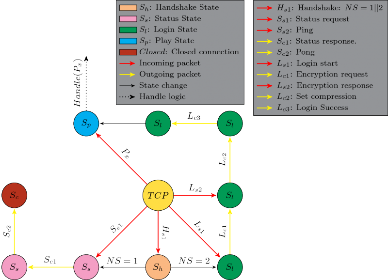

# 如何编写服务端

创建本教程是为了记录编写一个独立服务器与Notchian客户机交互所需的操作。本教程不完整，但一旦发现更多信息，将进行更新。

## 在你开始之前

- 确保您不想fork或加入 [现有项目](https://wiki.vg/Server_List) 。
- 知道你为什么要这么做。
- 选择一种具有良好网络特性的语言，如Java、C#或Python。（如果你想与众不同，选择一种更快的语言，比如C或者Rust！）

## 不使用包装器/库

如果您不使用包装器/库，那么您将需要手动完成所有的底层工作。

### 接收TCP数据包

Minecraft服务器接受来自TCP客户端的连接，并使用*包*与它们通信。数据包是通过TCP连接发送的字节序列。数据包的含义取决于它的数据包标识和当前连接状态。每个连接的初始状态是 [握手](Protocol.md#握手) ，并使用数据包 [握手](Protocol.md#握手) 切换状态（[握手](Protocol.md#握手)， `0x00` ，服务端）和 [登录成功](Protocol.md#登录成功)（[登录](Protocol.md#登录)， `0x02` ，客户端）。您可以在 [协议](Protocol.md)上阅读更多有关Minecraft数据包的信息。

## [服务器列表Ping](Server_List_Ping.md)

您的服务器需要接受一个握手( `0x00` ，state= `1` )和一个请求包，您将用一个包含JSON的响应包来响应它，该响应包详细说明了服务器。您可以在 [服务器列表Ping](Server_List_Ping.md) 上阅读更多有关此内容的信息。

### 用FSM处理新TCP连接的示例

作为如何处理新的TCP连接的示例，我们可以看看这个非正式的 [FSM](http://en.wikipedia.org/wiki/Finite-state_machine) 以获取如何编写服务器状态的示例。

为了区分FSM状态和连接状态，不同的连接状态被用颜色编码，以便于理解转换。给定的连接状态为：

- Handshake(握手)
- Status(状态)
- Login(登录)
- Play(游玩)
- Closed (关闭) (为了清楚起见加上去的，如 [Pong](Protocol.md#Pong) 关闭TCP套接字)

应该注意的是，输出分组不指向中间的*TCP*节点。这只是因为它简化了有限状态机。也有可能 [设置压缩](Protocol.md#设置压缩) 在 [登录成功](Protocol.md#登录成功) 之后发送，但它将具有不同的数据包id，因为连接状态将为 [游玩](Protocol.md#游玩) 而不是 [登录](Protocol.md#登录).

From https://wiki.vg/How_to_Write_a_Server