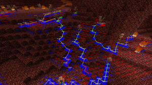

# 插件通道

**插件通道**允许客户端Mod和服务器插件进行通信，而不会扰乱聊天。[Dinnerbone提供的帖子](http://dinnerbone.com/blog/2012/01/13/minecraft-plugin-channels-messaging/)是一个很好的介绍和基本文档。

## 定义

### 数据类型

#### 路径实体

表示实体的计算路径。

| 
名称
 | 
类型
  |    
备注
     |
| :-------------------: | :--------------------: | :--------------------------: |
|  Current path index   |          Int           | 实体当前目标的点数组中的索引 |
|        Target         |   [路径点](#路径点)    |                              |
|   Number of points    |          Int           |      以下数组中的元素数      |
|     Points array      | [路径点](#路径点) 数组 |        路径上的实际点        |
|    Open set length    |          Int           |      以下数组中的元素数      |
|       Open set        | [路径点](#路径点) 数组 |                              |
|   Closed set length   |          Int           |      以下数组中的元素数      |
|      Closed set       | [路径点](#路径点) 数组 |                              |

参见 [搜索算法](https://en.wikipedia.org/wiki/A*_search_algorithm) 。

#### 路径点

表示路径中的单点

| 
名称
 | 
类型
 | 
备注
 |
| :-------------------: | :-------------------: | :-------------------: |
|           X           |          Int          |                       |
|           Y           |          Int          |                       |
|           Z           |          Int          |                       |
| Distance from origin  |         Float         |                       |
|         Cost          |         Float         |                       |
|      Cost malus       |         Float         |      呈现的数字       |
|   Has been visited    |        Boolean        |                       |
|       Node type       |       Int enum        |       参见下方        |
|  Distance to target   |         Float         |                       |

`Node type` (节点类型)的值:

- 0: BLOCKED
- 1: OPEN
- 2: WALKABLE
- 3: TRAPDOOR
- 4: FENCE
- 5: LAVA
- 6: WATER
- 7: WATER_BORDER
- 8: RAIL
- 9: DANGER_FIRE
- 10: DAMAGE_FIRE
- 11: DANGER_CACTUS
- 12: DAMAGE_CACTUS
- 13: DANGER_OTHER
- 14: DAMAGE_OTHER
- 15: DOOR_OPEN
- 16: DOOR_WOOD_CLOSED
- 17: DOOR_IRON_CLOSED
- 18: BREACH
- 19: LEAVES
- 20: STICKY_HONEY
- 21: COCOA

## 保留通道

### `minecraft:register`

*双向*

允许客户端或服务器注册一个或多个自定义通道，指示如果接收端也支持，则应在这些通道上发送数据。有效载荷是由空( `0x00` )分隔的字符串列表。

该频道已在1.13后被 [重命名](https://twitter.com/Dinnerbone/status/1012052979250319360) 为 `REGISTER` 。

### `minecraft:unregister`

*双向*

允许客户端或服务器从一个或多个自定义通道注销，指示接收端应停止在这些通道上发送数据。有效载荷是一个以空分隔的字符串列表。这仅在连接客户端时禁用/卸载插件时才有用。

该频道已在1.13后被 [重命名](https://twitter.com/Dinnerbone/status/1012052979250319360) 为 `UNREGISTER` 。

## Minecraft 内部通道

从1.3开始，Minecraft本身就使用几个插件通道来实现新特性。这些内部通道使用 `minecraft` 命名空间。它们是**未**使用注册通道正式注册的。Vanilla Minecraft服务器将无论如何发送这些包，而Vanilla客户端将接受它们。

请注意，最初包含了更多的通道，但大多数通道在1.13中被删除。见 [本条修订](https://wiki.vg/index.php?title=Plugin_channels&oldid=14089) ，用于原始列表。从1.14版本开始，除了品牌通道以外，剩下的唯一通道是调试相关的通道，这些通道通常不发送。

### `minecraft:brand`

*双向*

玩家登录后立即公布服务端和客户端名称。对于Notchian客户端和服务端，这是“Vanilla”（使用函数选择的`net.minecraft.client.ClientBrandRetriever.getClientModName()`）（编码为 [protocol string](https://wiki.vg/Data_Types) : 长度前缀为VarInt的UTF-8字符串）。

这些品牌用于崩溃报告和其他一些位置，建议自定义客户端和服务端使用更改的品牌以进行标识(对于Notchian客户端，用于获取品牌的类是为数不多的非模糊类之一)。不会以任何其他方式处理该品牌，并且Notchian客户端将连接到具有已更改品牌的服务器，不会出现任何问题(该品牌不用于验证)。

Notchian服务器发送 `minecraft:brand` 一个 [加入游戏](Protocol.md#加入游戏) 包，Notchian客户端在收到加入游戏包后立即发送它。但是，一些修改过的客户端和服务端不会发送这个包(或者比正常情况下发送要花更长的时间)，所以如果品牌没有被发送，那么不崩溃是很重要的。此外，品牌可能随时发生变化(例如，如果通过 `BungeeCoder` 实例连接，您可以从一个品牌的服务器切换到另一个品牌的服务器，而无需接收加入游戏包)。

### `minecraft:debug/paths`

*服务端对客户端*

如 [快照16w14a公告](https://web.archive.org/web/20161224194609/http://mojang.com/2016/04/minecraft-snapshot-16w14a/) 所示，`minecraft:debug/paths` 的目的是什么，在正常游戏中*找不到*。

从未发送，但在路径查找调试中执行某些操作。客户机读取并存储数据，但如果不进行修改，则无法启用其渲染器。

| 
名称
 | 
类型
 |           
备注
            |
| :-------------------: | :-------------------: | :----------------------------------------: |
|       Unknown 1       |          Int          | 在存储此数据的映射中用作键；可能是实体ID？ |
|       Unknown 2       |         Float         |     似乎是每个路径点的正方形的 `半径`      |
|        Entity         | [路径实体](#路径实体) |             参见上面的数据类型             |

路径实体的索引点渲染为红色，其他索引点渲染为蓝色。路径实体的目标路径点渲染为绿色立方体。路径点的闭合集渲染为红色，开放集渲染为绿色。

### `minecraft:debug/neighbors_update`

*服务端对客户端*

从未发送，但用于调试方块更新。在不修改客户端的情况下不会渲染。

| 
名称
 | 
类型
 |                    
备注
                     |
| :-------------------: | :-------------------: | :----------------------------------------------------------: |
|         Time          |        VarLong        | 更新发生的世界时间戳。在这个时间戳之后200 tick，给定的更新将停止渲染 |
|       Location        |       Position        |                       更新的方块的位置                       |

From https://wiki.vg/Plugin_channels
