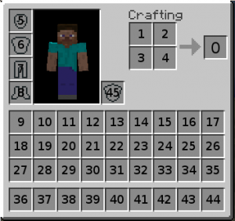
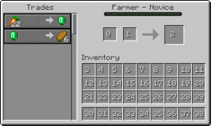

# 协议
Note: 本文是关于Minecraft Java版本([1.15.2, protocol578](Protocol_version_numbers.md))最新稳定版本的协议。有关Java版本的预发行版，请参阅`预发行协议`。对于不完整的基岩版文档，请参见`基岩协议`。有关旧版Pocket Edition，请参阅`Pocket Edition协议文档`。

本页提供了对于当前Minecraft协议的分析。
如果您遇到问题，请查看[协议常见问题解答](Protocol_FAQ.md)或在IRC频道[#mcdevs on irc.freenode.net](ircs://chat.freenode.net:6697/mcdevs)上寻求帮助([更多信息](http://wiki.vg/MCDevs))。

虽然您可以不受限制地使用此页面的内容来创建服务器、客户机、机器人程序等，但如果您将此页面的任何内容复制到其他地方发布，则仍需要为`#mcdevs`提供归属。

版本之间的更改可以在[协议历史记录](Protocol_History.md)中查看。

**目录**

<!-- TOC -->

- [描述](#描述)
  - [数据类型](#数据类型)
  - [标识符](#标识符)
  - [VarInt 与 VarLong](#varint-与-varlong)
  - [位置](#位置)
  - [定点数字](#定点数字)
  - [粒子](#粒子)
  - [其他定义](#其他定义)
- [数据包格式](#数据包格式)
  - [无压缩](#无压缩)
  - [有压缩](#有压缩)
- [握手](#握手)
  - [客户端](#客户端)
  - [服务端](#服务端)
    - [握手](#握手-1)
    - [旧服务器列表Ping](#旧服务器列表ping)
- [状态](#状态)
  - [客户端](#客户端-1)
    - [应答](#应答)
    - [Pong](#pong)
  - [服务端](#服务端-1)
    - [请求](#请求)
    - [Ping](#ping)
- [登录](#登录)
  - [客户端](#客户端-2)
    - [登录时断开连接](#登录时断开连接)
    - [加密请求](#加密请求)
    - [登录成功](#登录成功)
    - [设置压缩](#设置压缩)
    - [登录插件请求](#登录插件请求)
  - [服务端](#服务端-2)
    - [开始登录](#开始登录)
    - [加密应答](#加密应答)
    - [登录插件应答](#登录插件应答)
- [游玩](#游玩)
  - [客户端](#客户端-3)
    - [生成实体](#生成实体)
    - [生成经验球](#生成经验球)
    - [生成天气实体](#生成天气实体)
    - [生成生物实体](#生成生物实体)
    - [生成画](#生成画)
    - [生成玩家](#生成玩家)
    - [实体动画 (客户端)](#实体动画-客户端)
    - [统计](#统计)
    - [确认玩家挖掘](#确认玩家挖掘)
    - [方块挖掘动画](#方块挖掘动画)
    - [方块实体数据](#方块实体数据)
    - [方块行为](#方块行为)
    - [方块改变](#方块改变)
    - [Boss 血条](#boss-血条)
    - [服务器难度](#服务器难度)
    - [聊天消息(客户端)](#聊天消息客户端)
    - [多方块改变](#多方块改变)
    - [Tab完成 (客户端)](#tab完成-客户端)
    - [定义命令](#定义命令)
    - [窗口确认 (客户端)](#窗口确认-客户端)
    - [关闭窗口 (客户端)](#关闭窗口-客户端)
    - [更新窗口物品](#更新窗口物品)
    - [窗口属性](#窗口属性)
    - [设置槽位](#设置槽位)
    - [设置冷却时间](#设置冷却时间)
    - [插件消息 (客户端)](#插件消息-客户端)
    - [命名音效](#命名音效)
    - [断开连接 (游玩中)](#断开连接-游玩中)
    - [实体状态](#实体状态)
    - [爆炸](#爆炸)
    - [卸载区块](#卸载区块)
    - [切换游戏状态](#切换游戏状态)
    - [打开马窗口](#打开马窗口)
    - [保持活动 (客户端)](#保持活动-客户端)
    - [区块数据](#区块数据)
    - [效果](#效果)
    - [粒子](#粒子-1)
    - [更新光源](#更新光源)
    - [加入游戏](#加入游戏)
    - [地图数据](#地图数据)
    - [交易列表](#交易列表)
    - [实体位置](#实体位置)
    - [实体位置与旋转](#实体位置与旋转)
    - [实体旋转](#实体旋转)
    - [实体运动](#实体运动)
    - [车辆移动 (客户端)](#车辆移动-客户端)
    - [打开书](#打开书)
    - [打开窗口](#打开窗口)
    - [打开签名编辑器](#打开签名编辑器)
    - [工艺配方应答](#工艺配方应答)
    - [玩家能力 (客户端)](#玩家能力-客户端)
    - [战斗事件](#战斗事件)
    - [玩家信息](#玩家信息)
    - [旋转玩家](#旋转玩家)
    - [玩家位置与朝向 (客户端)](#玩家位置与朝向-客户端)
    - [解锁配方](#解锁配方)
    - [销毁实体](#销毁实体)
    - [移除实体效果](#移除实体效果)
    - [发送资源包](#发送资源包)
    - [重生](#重生)
    - [实体头朝向](#实体头朝向)
    - [选择高级选项卡](#选择高级选项卡)
    - [世界边界](#世界边界)
    - [Camera](#camera)

<!-- /TOC -->

## 描述
Minecraft服务器接受来自TCP客户端的连接，并使用数据包与它们通信。数据包是通过TCP连接发送的字节序列。数据包的含义取决于它的数据包标识和当前连接状态。每个连接的初始状态是[握手](#握手)，使用数据包[握手](#握手)和[登录成功](#登录成功)来切换状态。

### 数据类型
所有通过网络发送的数据(除了VarInt和VarLong)都是[大端模式](http://en.wikipedia.org/wiki/Endianness#Big-endian)的，即字节从最高有效字节发送到最低有效字节。大多数日常计算机都是小端模式的，因此在通过网络发送数据之前，可能需要进行转换。


| <center>名称</center> |      <center>大小 (字节)</center>      |                             <center>取值</center>                             |                             <center>备注</center>                             |
| :-------------: | :-------------------: | :----------------------------------------------------------: | :----------------------------------------------------------: |
|     Boolean     |           1           |                     `false` 或 `true`                     |        True 被编码为 `0x01`, false 被编码为 `0x00`.        |
|      Byte       |           1           |               `-128` 至 `127` 之间               | 有符号8位整数，[二进制补码](http://en.wikipedia.org/wiki/Two%27s_complement) |
|  Unsigned Byte  |           1           |                 `0` 至 `255` 之间                 |                    无符号8位整数                    |
|      Short      |           2           |             `-32768 `至 `32767` 之间             |          有符号16位整数，二进制补码          |
| Unsigned Short  |           2           |                `0` 至 `65535` 之间                |                   无符号16位                   |
|       Int       |           4           |        `-2147483648 `至 `2147483647` 之间        |          有符号32位整数，二进制补码          |
|      Long       |           8           | `-9223372036854775808` 至`9223372036854775807` 之间 |          有符号64位整数，二进制补码          |
|      Float      |           4           | [单精度32位浮点数](http://en.wikipedia.org/wiki/Single-precision_floating-point_format) |                                                              |
|     Double      |           8           | [双精度64位浮点数](http://en.wikipedia.org/wiki/Double-precision_floating-point_format) |                                                              |
|   String (n)    |    ≥1 <br>≤ (n×4) + 3    | 一个 [Unicode](http://en.wikipedia.org/wiki/Unicode) [scalar values](http://unicode.org/glossary/#unicode_scalar_value) 序列 | [UTF-8](http://en.wikipedia.org/wiki/UTF-8) 字符串的前缀是一个 VarInt 型的数据，表示字符串的字节数。 `n` 字符的最大长度，因上下文而异；最多可使用 `n × 4` 字节来对 `n` 字符进行编码，并检查这些限制。最大的 `n` 值为 `32767` 。 `+ 3` 是由于 `VarInt` 有效最大长度的大小。 |
|      Chat       | ≥ 1<br/>≤ (32767×4) + 3 |               参见 [Chat](https://wiki.vg/Chat)               | 编码为最大长度为32767的字符串。 |
|   Identifier    | ≥ 1<br/>≤ (32767×4) + 3 | 参见下方的 `Identifier` | 编码为最大长度为32767的字符串。 |
|     VarInt      |       ≥ 1<br/>≤ 5   |        `-2147483648` 至 `2147483647` 之间        | 可变长度数据编码有符号32位整数的二进制补码；更多信息参见 `Protocol#VarInt_and_VarLong` |
|     VarLong     |       ≥ 1<br/>≤ 10       | `-9223372036854775808` 至`9223372036854775807` 之间 | 可变长度数据编码有符号64位整数的二进制补码；更多信息参见 `Protocol#VarInt_and_VarLong` |
| Entity Metadata |        Varies         |          有关实体的其他信息          | 参见 `Entities#Entity Metadata Format` |
|      Slot       |        Varies         |          背包或箱子中的物品栏          |          参见 `Slot_Data`          |
|     NBT Tag     |        Varies         |                      取决于上下文                      |                参见 `NBT`                |
|    Position     |           8           | 一个用来表示方块位置的整数: x (`-33554432` 至 `33554431` 之间), y (`-2048` 至 `2047` 之间), z (`-33554432` 至 `33554431` 之间) | x是26位整数，紧随其后的y是12位整数，紧随其后的z是26位整数 (所有都是有符号数，用二进制补码编码)。 参见 `Protocol#Position` |
|      Angle      |           1           | 以一整圈的1/256为步长的旋转角 | 是否有符号并不重要，因为得到的角度是相同的。 |
|      UUID       |          16           | 一个 [UUID](http://en.wikipedia.org/wiki/Universally_unique_identifier) | 编码为无符号128位整数（或两个无符号64位整数：最高有效位64位，然后是最低有效64位） |
|   Optional X    |    0 或 X的大小    |                类型为X的字段，或者为空     | 字段是否存在必须从上下文中知道。 |
|   Array of X    | X 的计数次数大小 |                零个或多个X型字段        |        计数必须从上下文中知道。 |
|     X Enum      |       X 的大小       |              给定列表中的特定值              | 必须从上下文中知道可能值的列表以及每个值如何编码为X。任何一方发送的无效值通常会导致客户端因错误而断开连接，甚至崩溃。 |
|   Byte Array    |        可变         |                      取决于上下文                      | 这只是一个零字节或更多字节的序列，其含义应该在其他地方解释，例如在包描述中。长度也必须从上下文中知道。 |

### 标识符

标识符是一个命名空间的位置，其形式为 `minecraft:thing`. 如果未提供命名空间，则默认为 `minecraft` (也就是说 `thing` 代表 `minecraft:thing` )。 自定义内容应始终位于其自己的命名空间中，而不是默认命名空间中。命名空间应仅使用字符 `0123456789abcdefghijklmnopqrstuvwxyz-_` ；实际名称应包含更多意义。 命名约定是 `lower_case_with_underscores`.

### VarInt 与 VarLong

可变长度格式，使较小的数字使用较少的字节。它们非常类似于[协议缓冲区变量](http://developers.google.com/protocol-buffers/docs/encoding#varints)：用7个最低有效位对值进行编码，最高有效位表示数字的下一部分是否有另一个字节。首先写入最低有效组，然后写入每个更高的组；因此，变量实际上是小端（但是，组是7位，而不是8位）。

VarInts变量永远不会超过5个字节，VarLongs变量永远不会超过10个字节。

读写VarInts类型和VarLongs类型变量的伪代码:

```Java
public static int readVarInt() {
    int numRead = 0;
    int result = 0;
    byte read;
    do {
        read = readByte();
        int value = (read & 0b01111111);
        result |= (value << (7 * numRead));

        numRead++;
        if (numRead > 5) {
            throw new RuntimeException("VarInt is too big");
        }
    } while ((read & 0b10000000) != 0);

    return result;
}
```

```Java
public static long readVarLong() {
    int numRead = 0;
    long result = 0;
    byte read;
    do {
        read = readByte();
        long value = (read & 0b01111111);
        result |= (value << (7 * numRead));

        numRead++;
        if (numRead > 10) {
            throw new RuntimeException("VarLong is too big");
        }
    } while ((read & 0b10000000) != 0);

    return result;
}
```

```Java
public static void writeVarInt(int value) {
    do {
        byte temp = (byte)(value & 0b01111111);
        // Note: >>> 意味着符号位与数字的其余部分一起移位，而不是单独保留
        value >>>= 7;
        if (value != 0) {
            temp |= 0b10000000;
        }
        writeByte(temp);
    } while (value != 0);
}
```

```Java
public static void writeVarLong(long value) {
    do {
        byte temp = (byte)(value & 0b01111111);
        // Note: >>> 意味着符号位与数字的其余部分一起移位，而不是单独保留
        value >>>= 7;
        if (value != 0) {
            temp |= 0b10000000;
        }
        writeByte(temp);
    } while (value != 0);
}
```


Warning: **请注意，Minecraft的VarInts不是使用协议缓冲区编码的；它只是类似的。如果你尝试使用协议缓冲区来编码VarInts，在某些情况下会得到错误的结果。主要区别在于:**<br>1. Minecraft 的 VarInts 都是有符号的，但是并不使用 ZigZag 编码。协议缓冲区有 3 种 Varints 的类型: `uint32` (正常编码，无符号)、 `sint32` (ZigZag 编码，有符号) 与 `int32` (正常编码，有符号). Minecraft 是 `int32` 的变种。因为Minecraft使用普通编码而不是 ZigZag 编码，负值总是使用最大字节数。<br>2. Minecraft 的 VarInts 永远不会超过5个字节，其 VarLongs 永远不会超过10个字节，而协议缓冲区变量在编码负数时总是使用10个字节，即使它是 `int32` 类型的。

VarInts样例:

| <center>值</center> | <center>十六进制</center> | <center>十进制</center> |
| :-----------------: | :-----------------------: | :---------------------: |
|          0          |           0x00            |            0            |
|          1          |           0x01            |            1            |
|          2          |           0x02            |            2            |
|         127         |           0x7f            |           127           |
|         128         |         0x80 0x01         |          128 1          |
|         255         |         0xff 0x01         |          255 1          |
|     2147483647      | 0xff 0xff 0xff 0xff 0x07  |    255 255 255 255 7    |
|         -1          | 0xff 0xff 0xff 0xff 0x0f  |   255 255 255 255 15    |
|     -2147483648     | 0x80 0x80 0x80 0x80 0x08  |    128 128 128 128 8    |

VarLongs样例:

| <center>值</center>  |             <center>十六进制</center>             |        <center>十进制</center>        |
| :------------------: | :-----------------------------------------------: | :-----------------------------------: |
|          0           |                       0x00                        |                   0                   |
|          1           |                       0x01                        |                   1                   |
|          2           |                       0x02                        |                   2                   |
|         127          |                       0x7f                        |                  127                  |
|         128          |                     0x80 0x01                     |                 128 1                 |
|         255          |                     0xff 0x01                     |                 255 1                 |
|      2147483647      |             0xff 0xff 0xff 0xff 0x07              |           255 255 255 255 7           |
| 9223372036854775807  |   0xff 0xff 0xff 0xff 0xff 0xff 0xff 0xff 0x7f    |  255 255 255 255 255 255 255 255 127  |
|          -1          | 0xff 0xff 0xff 0xff 0xff 0xff 0xff 0xff 0xff 0x01 | 255 255 255 255 255 255 255 255 255 1 |
|     -2147483648      | 0x80 0x80 0x80 0x80 0xf8 0xff 0xff 0xff 0xff 0x01 | 128 128 128 128 248 255 255 255 255 1 |
| -9223372036854775808 | 0x80 0x80 0x80 0x80 0x80 0x80 0x80 0x80 0x80 0x01 | 128 128 128 128 128 128 128 128 128 1 |

### 位置

**Note:** 您在这里看到的是最新版本的位置类型，但是位置类型不同于 [1.14之前的位置类型 ](https://wiki.vg/index.php?title=Data_types&oldid=14345#Position)。

64位的值被分割为下面三部分:

- x: 26 最高有效位
- z: 26 中间有效位
- y: 12 最低有效位

编码如下:

```Java
((x & 0x3FFFFFF) << 38) | ((z & 0x3FFFFFF) << 12) | (y & 0xFFF)
```

解码如下:

```Java
val = read_unsigned_long();
x = val >> 38;
y = val & 0xFFF;
z = (val << 26 >> 38);
```

Note: 位移位的细节与语言有很大的依赖性；上面的方法在Java中可能有效，但在其他语言中可能不需要做一些调整。特别地，即使实际坐标是负数，通常也会得到正数。可以通过添加以下内容来解决此问题:

```Java
if x >= 2^25 { x -= 2^26 }
if y >= 2^11 { y -= 2^12 }
if z >= 2^25 { z -= 2^26 }
```

### 定点数字

有些字段可以存储为[定点数字](https://en.wikipedia.org/wiki/Fixed-point_arithmetic)，其中一定数量的位表示有符号整数部分（小数点左侧的数字），其余部分表示小数部分（右侧）。相反，浮点（float和double）将数字本身（尾数）保存在一个块中，而小数点（指数）的位置存储在它旁边。

本质上，虽然定点数的范围比浮点小，但对于较高的值，它们的分数精度更高。这使得它们非常适合于在Minecraft中表示实体的全局坐标，因为准确地存储整数部分比在单个块（或米）中更精确地定位它们更重要。

坐标通常表示为32位整数，其中5位最低有效位专用于小数部分，其余部分存储整数部分。

Java缺乏对分数整数的直接支持，但可以将它们表示为整数。要从双精度转换为此整数表示，请使用以下公式：

```Java
 abs_int = (int) (double * 32.0D);
```

逆运算:

```Java
 double = (double) (abs_int / 32.0D);
```

### 粒子

| <center>结构名称</center> | <center>结构类型</center> |        <center>意义</center>         |
| :-----------------------: | :-----------------------: | :----------------------------------: |
|            ID             |          VarInt           |      粒子类型的ID，请参见下文。      |
|           Data            |          Varies           | 根据粒子类型而有所不同，请参见下文。 |

|     <center>粒子名称</center>     | <center>粒子ID</center> |                    <center>数据</center>                     |
| :-------------------------------: | :---------------------: | :----------------------------------------------------------: |
| `minecraft:ambient_entity_effect` |            0            |                              无                              |
|    `minecraft:angry_villager`     |            1            |                              无                              |
|        `minecraft:barrier`        |            2            |                              无                              |
|         `minecraft:block`         |            3            | {"字段名称": "BlockState",<br/>"字段类型": "VarInt",<br/>"意义": "方块状态的ID"} |
|        `minecraft:bubble`         |            4            |                              无                              |
|         `minecraft:cloud`         |            5            |                              无                              |
|         `minecraft:crit`          |            6            |                              无                              |
|   `minecraft:damage_indicator`    |            7            |                              无                              |
|     `minecraft:dragon_breath`     |            8            |                              无                              |
|     `minecraft:dripping_lava`     |            9            |                              无                              |
|     `minecraft:falling_lava`      |           10            |                              无                              |
|     `minecraft:landing_lava`      |           11            |                              无                              |
|    `minecraft:dripping_water`     |           12            |                              无                              |
|     `minecraft:falling_water`     |           13            |                              无                              |
|         `minecraft:dust`          |           14            | [{"字段名称": "Red",<br/>"字段类型": "Float",<br/>"意义": "红色分量值，0~1"},<br/><br/>{"字段名称": "Green",<br/>"字段类型": "Float",<br/>"意义": "绿色分量值，0~1"},<br/><br/>{"字段名称": "Blue",<br/>"字段类型": "Float",<br/>"意义": "蓝色分量值，0~1"},<br/><br/>{"字段名称": "Scale",<br/>"字段类型": "Float",<br/>"意义": "比例尺，固定在0.01到4之间"}] |
|        `minecraft:effect`         |           15            |                              无                              |
|    `minecraft:elder_guardian`     |           16            |                              无                              |
|     `minecraft:enchanted_hit`     |           17            |                              无                              |
|        `minecraft:enchant`        |           18            |                              无                              |
|        `minecraft:end_rod`        |           19            |                              无                              |
|     `minecraft:entity_effect`     |           20            |                              无                              |
|   `minecraft:explosion_emitter`   |           21            |                              无                              |
|       `minecraft:explosion`       |           22            |                              无                              |
|     `minecraft:falling_dust`      |           23            | {"字段名称": "BlockState",<br/>"字段类型": "VarInt",<br/>"意义": "方块状态的ID"} |
|       `minecraft:firework`        |           24            |                              无                              |
|        `minecraft:fishing`        |           25            |                              无                              |
|         `minecraft:flame`         |           26            |                              无                              |
|         `minecraft:flash`         |           27            |                              无                              |
|    `minecraft:happy_villager`     |           28            |                              无                              |
|       `minecraft:composter`       |           29            |                              无                              |
|         `minecraft:heart`         |           30            |                              无                              |
|    `minecraft:instant_effect`     |           31            |                              无                              |
|         `minecraft:item`          |           32            | {"字段名称": "Item",<br/>"字段类型": "[Slot](https://wiki.vg/Slot)",<br/>"意义": "将要使用的物品"} |
|      `minecraft:item_slime`       |           33            |                              无                              |
|     `minecraft:item_snowball`     |           34            |                              无                              |
|      `minecraft:large_smoke`      |           35            |                              无                              |
|         `minecraft:lava`          |           36            |                              无                              |
|       `minecraft:mycelium`        |           37            |                              无                              |
|         `minecraft:note`          |           38            |                              无                              |
|         `minecraft:poof`          |           39            |                              无                              |
|        `minecraft:portal`         |           40            |                              无                              |
|         `minecraft:rain`          |           41            |                              无                              |
|         `minecraft:smoke`         |           42            |                              无                              |
|        `minecraft:sneeze`         |           43            |                              无                              |
|         `minecraft:spit`          |           44            |                              无                              |
|       `minecraft:squid_ink`       |           45            |                              无                              |
|     `minecraft:sweep_attack`      |           46            |                              无                              |
|   `minecraft:totem_of_undying`    |           47            |                              无                              |
|      `minecraft:underwater`       |           48            |                              无                              |
|        `minecraft:splash`         |           49            |                              无                              |
|         `minecraft:witch`         |           50            |                              无                              |
|      `minecraft:bubble_pop`       |           51            |                              无                              |
|     `minecraft:current_down`      |           52            |                              无                              |
|   `minecraft:bubble_column_up`    |           53            |                              无                              |
|       `minecraft:nautilus`        |           54            |                              无                              |
|        `minecraft:dolphin`        |           55            |                              无                              |
|  `minecraft:campfire_cosy_smoke`  |           56            |                              无                              |
| `minecraft:campfire_signal_smoke` |           57            |                              无                              |
|    `minecraft:dripping_honey`     |           58            |                              无                              |
|     `minecraft:falling_honey`     |           59            |                              无                              |
|     `minecraft:landing_honey`     |           60            |                              无                              |
|    `minecraft:falling_nectar`     |           61            |                              无                              |

### 其他定义

| <center>术语</center> |                    <center>定义</center>                     |
| :-------------------: | :----------------------------------------------------------: |
|     Player(玩家)      |      当使用单数时，`Player`总是指连接到服务器的客户端。      |
|     Entity(实体)      | `Entity`指的是任何物品、玩家、怪物、矿车或船等。请参阅 [实体](http://minecraft.gamepedia.com/Entity) 的完整名单。 |
|          EID          | 实体`EID`是用于标识特定实体的4字节序列，在整个服务器上是唯一的。 |
|          XYZ          | 在本文档中，轴名称与调试屏幕（F3）中显示的名称相同。`Y`向上，`X`指向东，`Z`指向南。 |
|          米           | 米是Minecraft的基本长度单位，等于一个实心方块的顶点之间的长度。术语“方块”可用于表示“米”或“立方米”。 |
|      全局调色板       | 将非负整数映射到方块状态的表/字典/调色板。方块状态标识是根据赋值顺序以线性方式创建的。为方块的每个方块状态分配一个方块状态ID；如果一个方块有多个属性，则分配的状态数是每个属性值的乘积，在[burger](https://pokechu22.github.io/Burger/1.15.2.html)上可以找到属性和状态ID范围的当前列表。官方Vanilla服务端现在包含一个选项，通过运行`java -cp minecraft_server.jar net.minecraft.data.Main --reports`. 参见 [Data Generators](https://wiki.vg/Data_Generators) 以获取更多信息。 |
|       Notchian        |      Mojang开发和发布的适配于Vanilla服务端的官方版本。       |

## 数据包格式

### 无压缩

| <center>字段名称</center> | <center>字段类型</center> |           <center>备注</center>            |
| :-----------------------: | :-----------------------: | :----------------------------------------: |
|          Length           |          VarInt           |           数据包ID和数据的总长度           |
|         Packet ID         |          VarInt           |                  数据包ID                  |
|           Data            |        Byte Array         | 取决于连接状态和数据包ID，请参阅下面的部分 |

### 有压缩

一旦具有非负阈值的 [Set Compression](https://wiki.vg/Protocol#Set_Compression) 包被发送, [zlib](http://en.wikipedia.org/wiki/Zlib) 压缩将在之后所有数据包中启用。数据包的格式会有微小变化，以兼容未压缩数据包的大小。

| <center>是否压缩</center> | <center>数据名称</center> |          <center>数据类型</center>          |               <center>备注</center>                |
| :-----------------------: | :-----------------------: | :-----------------------------------------: | :------------------------------------------------: |
|            否             |       Packet Length       |                   VarInt                    | Data Length的长度 + (Packet ID + Data)的压缩后长度 |
|            否             |        Data Length        |                   VarInt                    |        (Packet ID + Data)的未压缩长度 or 0         |
|            是             |         Packet ID         |                   VarInt                    |     zlib 压缩后的 packet ID (请参阅下面的部分)     |
|           数据            |        Byte Array         | zlib 压缩后的数据包 data (请参阅下面的部分) |                                                    |

数据包长度字段给出的长度是该数据包中剩余的字节数，包括数据长度字段。

如果数据长度设置为零，则数据包未压缩；否则为未压缩数据包的大小。

如果压缩了，(数据包ID+数据)的未压缩长度必须等于或超过数据包 [设置压缩](https://wiki.vg/Protocol#Set_Compression) 中设置的阈值,，否则接收方将断开连接。

通过发送数据包可以禁用压缩，通过 [设置压缩](https://wiki.vg/Protocol#Set_Compression) 设置为负阈值，或者根本不发送设置压缩的压缩包。

## 握手

### 客户端

没有处于握手状态的客户端数据包，因为在客户端发送第一个数据包后，协议立即切换到另一个状态。

### 服务端

#### 握手

这将导致服务器切换到目标状态。

|        包ID: `0x00`        | 状态: `Handshaking` |                        绑定到: 服务端                        |
| :------------------------: | :-----------------: | :----------------------------------------------------------: |
|        **字段名称**        |    **字段类型**     |                           **备注**                           |
| Protocol Version(协议版本) |       VarInt        | 参见 [协议版本号](https://wiki.vg/Protocol_version_numbers) (在 Minecraft 1.15.2中值为 `578`) |
| Server Address(服务器地址) |    String (255)     | 主机名或 IP ，例如 `localhost` 或 `127.0.0.1 `，这会被用于连接。官方服务端不使用该信息。 注意，SRV记录会被完全重定向，例如 `_minecraft._tcp.example.com` 代表 `mc.example.com` ，当用户试图连接 `mc.example.com` 时，服务器会自动重定向到`_minecraft._tcp.example.com` 所指向的服务器。 |
|  Server Port(服务器端口)   |   Unsigned Short    |         默认值为 `25565` ，官方服务端不使用该信息。          |
|   Next State(下一个状态)   |     VarInt Enum     |       `1` 表示 [状态](#状态) ， `2` 表示 [登录](#登录)       |

#### 旧服务器列表Ping

此数据包使用非标准格式。它从来没有长度前缀，包ID是无符号字节而不是变量。虽然在技术上不是当前协议的一部分，但旧客户端可以发送此数据包以启动 [服务器列表Ping](Server_List_Ping.md) ，新版服务端应该能够正确处理它。

| 包ID: `0xFE` | 状态: `Handshaking` |  绑定到: 服务端  |
| :----------: | :-----------------: | :--------------: |
| **字段名称** |    **字段类型**     |     **备注**     |
|   Payload    |    Unsigned Byte    | 值总为1 (`0x01`) |

参见 [服务器列表Ping#1.6](Server_List_Ping.md#1.6) 以获取更多有关细节。

## 状态

### 客户端

#### 应答

| 包ID: `0x00` | 状态: `Status` |                        绑定到: 客户端                        |
| :----------: | :------------: | :----------------------------------------------------------: |
| **字段名称** |  **字段类型**  |                           **备注**                           |
|  JSON 应答   | String (32767) | 参见 [服务器列表Ping#应答](Server_List_Ping.md#应答)，与所有字符串一样，这是以其长度作为前缀的VarInt类型变量 |

#### Pong

| 包ID: `0x01` | 状态: `Status` |     绑定到: 客户端     |
| :----------: | :------------: | :--------------------: |
| **字段名称** |  **字段类型**  |        **备注**        |
|   Payload    |      Long      | 应该与客户端发送的相同 |

### 服务端

#### 请求

| 包ID: `0x00` | 状态: `Status` | 绑定到: 服务端 |
| :----------: | :------------: | :------------: |
| **字段名称** |  **字段类型**  |    **备注**    |
|   *无字段*   |                |                |

#### Ping

| 包ID: `0x01` | 状态: `Status` |                        绑定到: 服务端                        |
| :----------: | :------------: | :----------------------------------------------------------: |
| **字段名称** |  **字段类型**  |                           **备注**                           |
|   Payload    |      Long      | 可以是任何数字。Notchian客户端使用依赖于系统的时间值，以毫秒计。 |

## 登录

登录过程如下:

1. C→S: [握手](#握手) 并且设置 `Next State` 为 `2`
2. C→S: [开始登录](#开始登录)
3. S→C: [加密请求](#加密请求)
4. 客户端身份验证
5. C→S: [加密应答](#加密应答)
6. 服务器身份验证，两者都启用加密
7. S→C: [设置压缩](#设置压缩) (可选)
8. S→C: [登录成功](#登录成功)

设置压缩，如果启用，必须在登录成功之前发送。 请注意，在设置压缩之后发送的任何内容都必须使用 [有压缩](#有压缩)

对于未经身份验证的（“破解版”/离线模式）和本地主机连接（这两个条件中的任何一个都足以用于未加密的连接），没有加密。在这种情况下 [开始登录](#开始登录) 后直接 [登录成功](#登录成功) 。

参见 [协议加密](Protocol_Encryption.md) 以获取更多细节

### 客户端

#### 登录时断开连接

| 包ID: `0x00` |        状态: `Login`         | 绑定到: 客户端 |
| :----------: | :--------------------------: | :------------: |
| **字段名称** |         **字段类型**         |    **备注**    |
|    Reason    | [Chat](https://wiki.vg/Chat) | 断开连接的原因 |

#### 加密请求

|    包ID: `0x01`     | 状态: `Login` |            绑定到: 客户端            |
| :-----------------: | :-----------: | :----------------------------------: |
|    **字段名称**     | **字段类型**  |               **备注**               |
|      Server ID      |  String (20)  |              似乎是空的              |
|  Public Key Length  |    VarInt     |         `Public Key` 的长度          |
|     Public Key      |  Byte Array   |                                      |
| Verify Token Length |    VarInt     | 验证令牌的长度。官方服务器总为`4` 。 |
|    Verify Token     |  Byte Array   |       服务器生成的随机字节序列       |

参见 [Protocol Encryption](https://wiki.vg/Protocol_Encryption) 以获取更多细节

#### 登录成功

| 包ID: `0x02` | 状态: `Login` |                      绑定到: 客户端                      |
| :----------: | :-----------: | :------------------------------------------------------: |
| **字段名称** | **字段类型**  |                         **备注**                         |
|     UUID     |  String (36)  | 与其他数据包不同，此字段将UUID作为带连字符的字符串包含。 |
|   Username   |  String (16)  |                       玩家的用户名                       |

此数据包将连接状态切换到 [游玩](#游玩) 。

Warning: 服务器可能需要一点时间才能完全转换到游玩状态，因此建议在发送游玩数据包之前等待，方法是设置超时，或者等待来自服务器的游玩数据包(通常是 [玩家信息](#玩家信息) )。Notchian客户端在下一个时钟的 [time update](https://wiki.vg/Protocol#Time_Update) 包之前不发送任何心跳包 ( [保持活动](#保持活动-客户端) ) 。

#### 设置压缩

启用压缩。如果启用压缩，则以下所有数据包都以[compressed packet format](https://wiki.vg/Protocol#With_compression)编码。负值或零值将禁用压缩，这意味着数据包格式应保持为[uncompressed packet format](https://wiki.vg/Protocol#Without_compression) 但是，这个包是完全可选的，如果不发送，压缩也不会被启用（当压缩被禁用时，Notchian服务器不发送数据包）。

| 包ID: `0x03` | 状态: `Login` |     绑定到: 客户端     |
| :----------: | :-----------: | :--------------------: |
| **字段名称** | **字段类型**  |        **备注**        |
|  Threshold   |    VarInt     | 压缩前数据包的最大大小 |

#### 登录插件请求

用于与 [登录插件应答](#登录插件应答) 一起实现自定义握手流。

与游玩模式下的插件消息不同，这些消息遵循锁步请求/响应方案，其中客户机将响应一个指示其是否理解的请求。Notchian客户端总是响应它不理解，并发送一个空的有效载荷。

| 包ID: `0x04` | 状态: `Login` |                        绑定到: 客户端                        |
| :----------: | :-----------: | :----------------------------------------------------------: |
| **字段名称** | **字段类型**  |                           **备注**                           |
|  Message ID  |    VarInt     |           由服务端生成（对于连接来说应该是唯一的）           |
|   Channel    |  Identifier   | [plugin channel](https://wiki.vg/Plugin_channel) 的名称，用于发送数据。 |
|     Data     |  Byte Array   |  任何数据，取决于频道。必须从数据包长度推断出此数组的长度。  |

### 服务端

#### 开始登录

| 包ID: `0x00` | 状态: `Login` | 绑定到: 服务端 |
| :----------: | :-----------: | :------------: |
| **字段名称** | **字段类型**  |    **备注**    |
|     Name     |  String (16)  |  玩家的用户名  |

#### 加密应答

|     包ID: `0x01`     | 状态: `Login` |     绑定到: 服务端     |
| :------------------: | :-----------: | :--------------------: |
|     **字段名称**     | **字段类型**  |        **备注**        |
| Shared Secret Length |    VarInt     | `Shared Secret` 的长度 |
|    Shared Secret     |  Byte Array   |                        |
| Verify Token Length  |    VarInt     | `Verify Token` 的长度  |
|     Verify Token     |  Byte Array   |                        |

参见 [Protocol Encryption](https://wiki.vg/Protocol_Encryption) 以获取更多细节

#### 登录插件应答

| 包ID: `0x02` |    状态: `Login`    |                        绑定到: 服务端                        |
| :----------: | :-----------------: | :----------------------------------------------------------: |
| **字段名称** |    **字段类型**     |                           **备注**                           |
|  Message ID  |       VarInt        |                     应与服务端的ID匹配。                     |
|  Successful  |       Boolean       | `true` 表示客户端理解请求，`false` 则相反。当值为 `false` 时，没有有效载荷跟随。 |
|     Data     | Optional Byte Array |  任何数据，取决于频道。必须从数据包长度推断出此数组的长度。  |

## 游玩

### 客户端

#### 生成实体

在创建车辆或其他非生命实体时由服务器发送。

| 包ID: `0x00` | 状态: `Play` |                        绑定到: 客户端                        |
| :----------: | :----------: | :----------------------------------------------------------: |
| **字段名称** | **字段类型** |                           **备注**                           |
|  Entity ID   |    VarInt    |                        生成实体的EID                         |
| Object UUID  |     UUID     |                        生成实体的UUID                        |
|     Type     |    VarInt    | 实体类型 (参见 [Spawn Living Entity](https://wiki.vg/Protocol#Spawn_Living_Entity)) |
|      X       |    Double    |                                                              |
|      Y       |    Double    |                                                              |
|      Z       |    Double    |                                                              |
|    Pitch     |    Angle     |                                                              |
|     Yaw      |    Angle     |                                                              |
|     Data     |     Int      | 含义取决于类型字段的值，参见 [Object Data](https://wiki.vg/Object_Data) |
|  Velocity X  |    Short     | 与 [Entity Velocity](https://wiki.vg/Protocol#Entity_Velocity) 是相同的单元。始终发送，但仅在数据大于 `0` 时使用 (某些始终忽略它的实体除外，参见 [Object Data](https://wiki.vg/Object_Data) ). |
|  Velocity Y  |    Short     |                                                              |
|  Velocity Z  |    Short     |                                                              |

#### 生成经验球

生成一个或多个经验球。

| 包ID: `0x01` | 状态: `Play` |        绑定到: 客户端        |
| :----------: | :----------: | :--------------------------: |
| **字段名称** | **字段类型** |           **备注**           |
|  Entity ID   |    VarInt    |        生成实体的EID         |
|      X       |    Double    |                              |
|      Y       |    Double    |                              |
|      Z       |    Double    |                              |
|    Count     |    Short     | 此经验球收集后将奖励的经验量 |

#### 生成天气实体

通过这个包，服务器通知客户端在玩家周围512个街区半径范围内发生雷击。坐标指定了雷电袭击的确切位置。

| 包ID: `0x02` | 状态: `Play` |          绑定到: 客户端          |
| :----------: | :----------: | :------------------------------: |
| **字段名称** | **字段类型** |             **备注**             |
|  Entity ID   |    VarInt    |          生成实体的EID           |
|     Type     |  Byte Enum   | 全局实体类型，生成雷电的值为 `1` |
|      X       |    Double    |                                  |
|      Y       |    Double    |                                  |
|      Z       |    Double    |                                  |

#### 生成生物实体

在生成生物实体时由服务器发送。

| 包ID: `0x03` | 状态: `Play` |                        绑定到: 客户端                        |
| :----------: | :----------: | :----------------------------------------------------------: |
| **字段名称** | **字段类型** |                           **备注**                           |
|  Entity ID   |    VarInt    |                        生成实体的EID                         |
| Entity UUID  |     UUID     |                        生成实体的UUID                        |
|     Type     |    VarInt    | 怪物的类型，参见 [Entities#Mobs](https://wiki.vg/Entities#Mobs) |
|      X       |    Double    |                                                              |
|      Y       |    Double    |                                                              |
|      Z       |    Double    |                                                              |
|     Yaw      |    Angle     |                                                              |
|    Pitch     |    Angle     |                                                              |
|  Head Pitch  |    Angle     |                                                              |
|  Velocity X  |    Short     | 相同的单元，参见 [Entity Velocity](https://wiki.vg/Protocol#Entity_Velocity) |
|  Velocity Y  |    Short     | 相同的单元，参见 [Entity Velocity](https://wiki.vg/Protocol#Entity_Velocity) |
|  Velocity Z  |    Short     | 相同的单元，参见 [Entity Velocity](https://wiki.vg/Protocol#Entity_Velocity) |

#### 生成画

这个包显示了位置、名称和画的类型。

| 包ID: `0x04` | 状态: `Play` |                  绑定到: 客户端                   |
| :----------: | :----------: | :-----------------------------------------------: |
| **字段名称** | **字段类型** |                     **备注**                      |
|  Entity ID   |    VarInt    |                   生成实体的EID                   |
| Entity UUID  |     UUID     |                  生成实体的UUID                   |
|    Motive    |    VarInt    |                  画的ID，见下方                   |
|   Location   |   Position   |                中心坐标（见下方）                 |
|  Direction   |  Byte Enum   | 画的朝向 (北 = `2`, 南 = `0`, 西 = `1`, 东 = `3`) |

计算图像的中心：给定一个 `(宽度 × 高度)` 单元格网格，其中 `(0,0)` 为左上角，则中心为 `(max(0, 宽度 / 2 - 1), 高度 / 2)` 。例如， `(1, 0)` 表示 `2×1` 的画， `(1, 2)` 表示 `4×4` 的画。

按坐标排列的绘画列表 `paintings_kristoffer_zetterstrand.png` （其中x和y从左上角以像素为单位，宽度和高度以像素或方块的十六分之一为单位）

|   <center>名称</center>   | <center>ID</center> | <center>x</center> | <center>y</center> | <center>宽度</center> | <center>高度</center> |
| :-----------------------: | :-----------------: | :----------------: | :----------------: | :-------------------: | :-------------------: |
|     `minecraft:kebab`     |          0          |         0          |         0          |          16           |          16           |
|     `minecraft:aztec`     |          1          |         16         |         0          |          16           |          16           |
|     `minecraft:alban`     |          2          |         32         |         0          |          16           |          16           |
|    `minecraft:aztec2`     |          3          |         48         |         0          |          16           |          16           |
|     `minecraft:bomb`      |          4          |         64         |         0          |          16           |          16           |
|     `minecraft:plant`     |          5          |         80         |         0          |          16           |          16           |
|   `minecraft:wasteland`   |          6          |         96         |         0          |          16           |          16           |
|     `minecraft:pool`      |          7          |         0          |         32         |          32           |          16           |
|    `minecraft:courbet`    |          8          |         32         |         32         |          32           |          16           |
|      `minecraft:sea`      |          9          |         64         |         32         |          32           |          16           |
|    `minecraft:sunset`     |         10          |         96         |         32         |          32           |          16           |
|    `minecraft:creebet`    |         11          |        128         |         32         |          32           |          16           |
|   `minecraft:wanderer`    |         12          |         0          |         64         |          16           |          32           |
|    `minecraft:graham`     |         13          |         16         |         64         |          16           |          32           |
|     `minecraft:match`     |         14          |         0          |        128         |          32           |          32           |
|     `minecraft:bust`      |         15          |         32         |        128         |          32           |          32           |
|     `minecraft:stage`     |         16          |         64         |        128         |          32           |          32           |
|     `minecraft:void`      |         17          |         96         |        128         |          32           |          32           |
|     `skull_and_roses`     |         18          |        128         |        128         |          32           |          32           |
|    `minecraft:wither`     |         19          |        160         |        128         |          32           |          32           |
|   `minecraft:fighters`    |         20          |         0          |         96         |          64           |          32           |
|    `minecraft:pointer`    |         21          |         0          |        192         |          64           |          64           |
|   `minecraft:pigscene`    |         22          |         64         |        192         |          64           |          64           |
| `minecraft:burning_skull` |         23          |        128         |        192         |          64           |          64           |
|   `minecraft:skeleton`    |         24          |        192         |         64         |          64           |          48           |
|  `minecraft:donkey_kong`  |         25          |        192         |        112         |          64           |          48           |

关于画的文章 [Minecraft绘制和画布](http://minecraft.gamepedia.com/Painting%23Canvases) 中还提供了实际图像的画的名称列表。

#### 生成玩家

当玩家进入可视范围时，服务器会发送这个包，而不是当玩家加入时。

必须在 [玩家信息](#玩家信息) 之后发送，用于添加客户端在生成玩家时使用的玩家数据。如果此数据包到达时，此数据包生成的玩家的玩家信息不存在，则Notchian客户端将不会生成玩家实体。玩家信息包括皮肤/披肩数据。

但是，服务器可以为不在可见范围内的玩家安全地生成玩家实体。客户端似乎正确地处理了它。

| 包ID: `0x05` | 状态: `Play` |                        绑定到: 客户端                        |
| :----------: | :----------: | :----------------------------------------------------------: |
| **字段名称** | **字段类型** |                           **备注**                           |
|  Entity ID   |    VarInt    |                          玩家的EID                           |
| Player UUID  |     UUID     | 对于 [离线模式](http://minecraft.gamepedia.com/Server.properties%23online-mode) 和NPC的说明，参见下文 |
|      X       |    Double    |                                                              |
|      Y       |    Double    |                                                              |
|      Z       |    Double    |                                                              |
|     Yaw      |    Angle     |                                                              |
|    Pitch     |    Angle     |                                                              |

处于 [联机模式](http://minecraft.gamepedia.com/Server.properties%23online-mode) 时，UUID必须有效并且具有有效的皮肤。

在离线模式下， [UUID v3](http://en.wikipedia.org/wiki/Universally_unique_identifier#Versions_3_and_5_.28namespace_name-based.29) 与字符串 `OfflinePlayer:<player name>` 一起使用，并使用UTF-8编码 (大小写敏感).

对于NPC，应使用UUID v2。

```
<+Grum> 我永远不会把这当做一个特性，你懂得 :)
```

一个合法的UUID应该像 `xxxxxxxx-xxxx-Yxxx-xxxx-xxxxxxxxxxxx` 这样，UUID的版本由 `Y` 指定。所以，对于UUID v3，`Y` 总为 `3 `，而对于UUID v2, `Y` 总为 `2` 。

#### 实体动画 (客户端)

每当实体需要更改时的动画（Animation）。

| 包ID: `0x06` | 状态: `Play`  |         绑定到: 客户端          |
| :----------: | :-----------: | :-----------------------------: |
| **字段名称** | **字段类型**  |            **备注**             |
|  Entity ID   |    VarInt     |            Player ID            |
|  Animation   | Unsigned Byte | Animation ID (动画ID，参见下文) |

`Animation` 可以是以下值之一：

| <center>ID</center> | <center>Animation</center> |
| :-----------------: | :------------------------: |
|          0          |          摆动主臂          |
|          1          |          受到伤害          |
|          2          |           离开床           |
|          3          |          摆动副手          |
|          4          |          临界效应          |
|          5          |        魔法临界效应        |

#### 统计

作为对 [客户端状态](https://wiki.vg/Protocol#Client_Status) 的应答(id 1).

|      包ID: `0x07`       | 状态: `Play`  |     绑定到: 客户端      |
| :---------------------: | :-----------: | :---------------------: |
|      **字段名称**       | **字段类型**  |        **备注**         |
|          Count          |    VarInt     | 以下数组Array中的元素数 |
| (Statistic)Category ID  | (Array)VarInt |        参见下方         |
| (Statistic)Statistic ID | (Array)VarInt |        参见下方         |
|          Value          |    VarInt     |        设置的值         |

类别(这些是以名称空间命名的，但把 `:` 替换为 `.` ):

类别(这些是名称空间设置的，但是使用 `:` 替换为 `.` ):

| <center>名称</center> | <center>ID</center> | <center>注册为</center> |
| :-------------------: | :-----------------: | :---------------------: |
|   `minecraft.mined`   |          0          |          方块           |
|  `minecraft.crafted`  |          1          |          物品           |
|   `minecraft.used`    |          2          |          物品           |
|  `minecraft.broken`   |          3          |          物品           |
| `minecraft.picked_up` |          4          |          物品           |
|  `minecraft.dropped`  |          5          |          物品           |
|  `minecraft.killed`   |          6          |          实体           |
| `minecraft.killed_by` |          7          |          实体           |
|  `minecraft.custom`   |          8          |         自定义          |

`方块` 、 `物品 `和 `实体` 使用方块(不是方块状态)、物品和实体的ID。

`自定义` 具有以下内容(客户端只关注单元):

|          <center>名称</center>           | <center>ID</center> | <center>单元</center> |
| :--------------------------------------: | :-----------------: | :-------------------: |
|          `minecraft.leave_game`          |          0          |          无           |
|       `minecraft.play_one_minute`        |          1          |         时间          |
|       `minecraft.time_since_death`       |          2          |         时间          |
|          `minecraft.sneak_Time`          |          3          |         时间          |
|         `minecraft.walk_one_cm`          |          4          |         距离          |
|        `minecraft.crouch_one_cm`         |          5          |         距离          |
|        `minecraft.sprint_one_cm`         |          6          |         距离          |
|         `minecraft.swim_one_cm`          |          7          |         距离          |
|         `minecraft.fall_one_cm`          |          8          |         距离          |
|         `minecraft.climb_one_cm`         |          9          |         距离          |
|          `minecraft.fly_one_cm`          |         10          |         距离          |
|         `minecraft.dive_one_cm`          |         11          |         距离          |
|       `minecraft.minecart_one_cm`        |         12          |         距离          |
|         `minecraft.boat_one_cm`          |         13          |         距离          |
|          `minecraft.pig_one_cm`          |         14          |         距离          |
|         `minecraft.horse_one_cm`         |         15          |         距离          |
|        `minecraft.aviate_one_cm`         |         16          |         距离          |
|             `minecraft.jump`             |         17          |          无           |
|             `minecraft.drop`             |         18          |          无           |
|         `minecraft.damage_dealt`         |         19          |         伤害          |
|         `minecraft.damage_taken`         |         20          |         伤害          |
|            `minecraft.deaths`            |         21          |          无           |
|          `minecraft.mob_kills`           |         22          |          无           |
|         `minecraft.animals_bred`         |         23          |          无           |
|         `minecraft.player_kills`         |         24          |          无           |
|         `minecraft.fish_caught`          |         25          |          无           |
|      `minecraft.talked_to_villager`      |         26          |          无           |
|     `minecraft.traded_with_villager`     |         27          |          无           |
|        `minecraft.eat_cake_slice`        |         28          |          无           |
|        `minecraft.fill_cauldron`         |         29          |          无           |
|         `minecraft.use_cauldron`         |         30          |          无           |
|         `minecraft.clean_armor`          |         31          |          无           |
|         `minecraft.clean_banner`         |         32          |          无           |
|  `minecraft.interact_with_brewingstand`  |         33          |          无           |
|     `minecraft.interact_with_beacon`     |         34          |          无           |
|       `minecraft.inspect_dropper`        |         35          |          无           |
|        `minecraft.inspect_hopper`        |         36          |          无           |
|      `minecraft.inspect_dispenser`       |         37          |          无           |
|        `minecraft.play_noteblock`        |         38          |          无           |
|        `minecraft.tune_noteblock`        |         39          |          无           |
|          `minecraft.pot_flower`          |         40          |          无           |
|    `minecraft.trigger_trapped_chest`     |         41          |          无           |
|       `minecraft.open_enderchest`        |         42          |          无           |
|         `minecraft.enchant_item`         |         43          |          无           |
|         `minecraft.play_record`          |         44          |          无           |
|    `minecraft.interact_with_furnace`     |         45          |          无           |
| `minecraft.interact_with_crafting_table` |         46          |          无           |
|          `minecraft.open_chest`          |         47          |          无           |
|         `minecraft.sleep_in_bed`         |         48          |          无           |
|       `minecraft.open_shulker_box`       |         49          |          无           |

单元:

- `无`: 仅自然数 (格式化为0位小数)
- `伤害`: 值是正常值的10倍
- `距离`: 以厘米为单位的距离(方块的百分之一)
- `时间`: 以tick为单位的时间跨度

#### 确认玩家挖掘

| 包ID: `0x08` | 状态: `Play` |                        绑定到: 客户端                        |
| :----------: | :----------: | :----------------------------------------------------------: |
| **字段名称** | **字段类型** |                           **备注**                           |
|   Location   |   Position   |                        挖掘发生的位置                        |
|    Block     |    VarInt    |             现在应该位于该位置的方块的方块状态ID             |
|    Status    | VarInt enum  | 和玩家挖掘一样。只有开始挖掘(`0`)、取消挖掘(`1`)和完成挖掘(`2`) |
|  Successful  |   Boolean    | 如果挖掘成功，则为 `True` ；如果客户端应撤消在本地所做的任何更改，则为 `False` （这是如何工作的？） |

#### 方块挖掘动画

0~9是可显示的挖掘阶段，每个数字表示此坐标上没有动画。

挖掘动画仍然可以应用于空中；动画将保持可见，尽管没有挖掘。但是，如果将其应用于透明方块，可能会出现奇怪的图形效果，包括水失去透明度。（在正常的游戏中可以看到类似的效果，比如破冰的时候）

如果需要同时显示多个挖掘动画，则必须为每个动画指定一个唯一的实体ID。实体ID不需要与客户端上的实际实体相对应，随机生成的数字就行。

| 包ID: `0x09`  | 状态: `Play` |     绑定到: 客户端      |
| :-----------: | :----------: | :---------------------: |
| **字段名称**  | **字段类型** |        **备注**         |
|   Entity ID   |    VarInt    |  挖掘方块实体的实体ID   |
|   Location    |   Position   |        方块位置         |
| Destroy Stage |     Byte     | 0~9是放置，其他值是移除 |

#### 方块实体数据

与方块关联的给定实体集。

| 包ID: `0x0A` |          状态: `Play`          |                        绑定到: 客户端                        |
| :----------: | :----------------------------: | :----------------------------------------------------------: |
| **字段名称** |          **字段类型**          |                           **备注**                           |
|   Location   |            Position            |                          方块的位置                          |
|    Action    |         Unsigned Byte          |                 要执行的更新类型，请参见下文                 |
|   NBT Data   | [NBT Tag](https://wiki.vg/NBT) | 要设置的数据。可能是`TAG_END` (`0`)，在这种情况下，给定位置的块实体将被删除（尽管这不是必需的，因为客户端将在块卸载或块删除时自动删除块实体） |

*Action* 字段:

- **1**: 设置一个刷怪笼的数据（除产生潜力外的所有东西：当前延迟、最小/最大延迟、要刷的怪物、刷怪数量、刷怪范围等）
- **2**: 设置命令方块文本（命令和上次执行状态）
- **3**: 设置信标的级别、主、次影响
- **4**: 设置怪物头部的旋转和皮肤
- **5**: 设置一个[潮涌核心](https://minecraft-zh.gamepedia.com/%E6%BD%AE%E6%B6%8C%E6%A0%B8%E5%BF%83)
- **6**: 在横幅上设置底色和图案
- **7**: 设置结构瓦实体的数据
- **8**: 设置 [末地折跃门](https://minecraft-zh.gamepedia.com/%E6%9C%AB%E5%9C%B0%E6%8A%98%E8%B7%83%E9%97%A8) 的目的地
- **9**: 设置告示牌的文字
- **10**: 未使用
- **11**: 设置一个床
- **12**: 设置拼图方块的数据
- **13**: 在篝火旁放置物品
- **14**: 蜂巢信息

#### 方块行为

这个包用于由方块执行的许多操作和动画，通常是非持久的。

参见 [Block Actions](https://wiki.vg/Block_Actions) 以获取值列表。

Warning: 本数据包使用方块ID，而不是方块状态。不幸的是，方块ID没有直接包含在 [Data Generators](https://wiki.vg/Data_Generators) 的输出中，但可以手动计算。

|     包ID: `0x0B`      | 状态: `Play`  |                        绑定到: 客户端                        |
| :-------------------: | :-----------: | :----------------------------------------------------------: |
|     **字段名称**      | **字段类型**  |                           **备注**                           |
|       Location        |   Position    |                           方块坐标                           |
|  Action ID (Byte 1)   | Unsigned Byte | 因方块而异 — 参见 [Block Actions](https://wiki.vg/Block_Actions) |
| Action Param (Byte 2) | Unsigned Byte | 因方块而异 — 参见 [Block Actions](https://wiki.vg/Block_Actions) |
|      Block Type       |    VarInt     |           方块类型ID，必须与给定坐标处的方块匹配。           |

#### 方块改变

每当在渲染距离内改变方块时激发。

Warning: 更改未加载的方块不是稳定的操作。Notchian客户机当前使用一个*shared*空方块，该方块针对已卸载方块中的所有方块更改进行了修改；而在1.9中，此方块从不在旧版本中呈现更改后的方块将出现在空方块的所有副本中。服务器应避免在未加载的方块中发送方块更改，而客户端应忽略此类包。

| 包ID: `0x0C` | 状态: `Play` |                        绑定到: 客户端                        |
| :----------: | :----------: | :----------------------------------------------------------: |
| **字段名称** | **字段类型** |                           **备注**                           |
|   Location   |   Position   |                           方块坐标                           |
|   Block ID   |    VarInt    | 在 [全局调色板](http://minecraft.gamepedia.com/Data_values%23Block_IDs) 中给定的新方块状态ID，更多信息请参见该部分 |

#### Boss 血条

|     包ID: `0x0D`      |         状态: `Play`         |                        绑定到: 客户端                        |
| :-------------------: | :--------------------------: | :----------------------------------------------------------: |
|     **字段名称**      |         **字段类型**         |                           **备注**                           |
|         UUID          |             UUID             |                      Boss 血条的唯一ID                       |
|        Action         |         VarInt Enum          | 确定剩余数据包的布局，如使用下方的 `(0: 添加)Title` 字段则填写 `0` |
|    (0: 添加)Title     | [Chat](https://wiki.vg/Chat) |                       Boss 血条的标题                        |
|    (0: 添加)Health    |            Float             | 从0到1。大于1的值不会使Notchian客户端崩溃，出现 [第二个Boss血条的](https://i.johni0702.de/nA.png) 的值在1.5左右。 |
|    (0: 添加)Color     |         VarInt Enum          |                      颜色ID (参见下方)                       |
|   (0: 添加)Division   |         VarInt Enum          |                     划分类型 (参见下方)                      |
|    (0: 添加)Flags     |        Unsigned Byte         | 位掩码。`0x01` 可使天空变暗，`0x02` 是末影龙血条(用于播放结束音乐)，`0x04` 创建雾(以前也由 `0x02 `控制) |
|   (1: 移除)*无字段*   |           *无字段*           |                      移除这个 Boss 血条                      |
|  (2: 更新血量)Health  |            Float             |                             同上                             |
|  (3: 更新标题)Title   | [Chat](https://wiki.vg/Chat) |                     更新 Boss 血条的标题                     |
|  (4: 更新风格)Color   |         VarInt Enum          |                      颜色ID (参见下方)                       |
| (4: 更新风格)Dividers |         VarInt Enum          |                             同上                             |
|  (5: 更新标志)Flags   |        Unsigned Byte         |                             同上                             |

| <center>颜色ID</center> | <center>颜色</center> |
| :---------------------: | :-------------------: |
|            0            |         粉色          |
|            1            |         蓝色          |
|            2            |         红色          |
|            3            |         绿色          |
|            4            |         黄色          |
|            5            |         紫色          |
|            6            |         白色          |

| <center>ID</center> | <center>划分类型</center> |
| :-----------------: | :-----------------------: |
|          0          |         *无划分*          |
|          1          |          6个槽口          |
|          2          |         10个槽口          |
|          3          |         12个槽口          |
|          4          |         20个槽口          |

#### 服务器难度

更改客户端选项菜单中的难度设置

|             包ID: `0x0E`              | 状态: `Play`  |                绑定到: 客户端                 |
| :-----------------------------------: | :-----------: | :-------------------------------------------: |
|             **字段名称**              | **字段类型**  |                   **备注**                    |
|              Difficulty               | Unsigned Byte | `0`: 和平， `1`: 简单， `2`: 正常， `3`: 困难 |
| Difficulty locked?<br>(是否锁定难度?) |    Boolean    |                                               |

#### 聊天消息(客户端)

识别聊天/系统消息之间的区别很重要，因为这有助于尊重用户的聊天消息。参见 [processing chat](https://wiki.vg/Chat#Processing_chat) 以获取更多信息。

Warning: `游戏信息` 接受JSON格式，但不显示它，尽管不推荐使用的基于§的格式。使用  [标题](#标题) 数据包时，这不是问题，因此最好使用该数据包在该槽位中显示信息。参见 [MC-119145](https://bugs.mojang.com/browse/MC-119145) 了解更多信息。

| 包ID: `0x0F` |         状态: `Play`         |                        绑定到: 客户端                        |
| :----------: | :--------------------------: | :----------------------------------------------------------: |
| **字段名称** |         **字段类型**         |                           **备注**                           |
|  JSON 数据   | [Chat](https://wiki.vg/Chat) |                       最大32767个字节                        |
|   Position   |             Byte             | `0`: 聊天 (chat box)， `1`: 系统消息 (chat box)， `2`: 游戏信息 (above hotbar). |

#### 多方块改变

每当在同一tick的同一方块中更改2个或更多块时，就会触发。

Warning: 更改客户端未加载的方块是不安全的，详见 [方块改变](#方块改变) 。

|        包ID: `0x10`         |     状态: `Play`     |                        绑定到: 客户端                        |
| :-------------------------: | :------------------: | :----------------------------------------------------------: |
|        **字段名称**         |     **字段类型**     |                           **备注**                           |
|           Chunk X           |         Int          |                         方块的X坐标                          |
|           Chunk Z           |         Int          |                         方块的Z坐标                          |
|        Record Count         |        VarInt        |             以下数组中的元素数，即受影响的方块数             |
| (Record)Horizontal Position | (Array)Unsigned Byte | 4个最高有效位( `0xF0` )编码相对于方块的X坐标。<br>4个最低有效位( `0x0F` )编码相对于方块的Z坐标。 |
|    (Record)Y Coordinate     | (Array)Unsigned Byte |                         方块的Y坐标                          |
|      (Record)Block ID       |    (Array)VarInt     | 在 [全局调色板](http://minecraft.gamepedia.com/Data_values%23Block_IDs) 中给定的块的新块状态ID，更多信息请参见该部分。 |

要将位置解码为世界位置:

```Java
//其中horizPos表示水平位置，vertPos表示垂直位置
worldX = (horizPos >> 4 & 15) + (chunkX * 16);
worldY = vertPos;
worldZ = (horizPos & 15) + (chunkZ * 16);
```

#### Tab完成 (客户端)

服务器以发送给它的最后一个单词的自动完成列表作为响应。在常规聊天的情况下，这是一个玩家用户名。也支持命令名和参数。客户端在列出它们之前按字母顺序对它们进行排序。

|     包ID: `0x11`     |                 状态: `Play`                 |                        绑定到: 客户端                        |
| :------------------: | :------------------------------------------: | :----------------------------------------------------------: |
|     **字段名称**     |                 **字段类型**                 |                           **备注**                           |
|          ID          |                    VarInt                    |                            事务ID                            |
|        Start         |                    VarInt                    |                       要替换文本的开头                       |
|        Length        |                    VarInt                    |                       要替换文本的长度                       |
|        Count         |                    VarInt                    |                      以下数组中的元素数                      |
|    (Matches)Match    |            (Array)String (32767)             | 要插入的一个合格值，请注意，每个命令都是单独发送的，而不是单个字符串，因此需要计数。请注意，在命令上不包括前导的 `/` 。 |
| (Matches)Has tooltip |                (Array)Boolean                |                如果存在以下情况，则为 `True`                 |
|   (Matches)Tooltip   | (Array)Optional [Chat](https://wiki.vg/Chat) |     要显示的工具提示；仅当先前的布尔值为 `True` 时才存在     |

#### 定义命令

列出服务器上的所有命令及其解析方式。

这是一个有向图，有一个根节点。每个重定向或子节点必须仅引用已声明的节点。

| 包ID: `0x12` |                 状态: `Play`                  |         绑定到: 客户端         |
| :----------: | :-------------------------------------------: | :----------------------------: |
| **字段名称** |                 **字段类型**                  |            **备注**            |
|    Count     |                    VarInt                     |       以下数组中的元素数       |
|    Nodes     | Array of [Node](https://wiki.vg/Command_Data) |            节点数组            |
|  Root index  |                    VarInt                     | 上一个数组中 `root` 节点的索引 |

有关此数据包的详细信息，请参阅 [Command Data](https://wiki.vg/Command_Data) 文章。

#### 窗口确认 (客户端)

来自服务器的一个数据包，指示来自客户端的请求是否被接受，或者是否存在冲突(由于延迟)。如果数据包未被接受，客户端必须用 [serverbound window confirmation](https://wiki.vg/Protocol#Window_Confirmation_.28serverbound.29) 进行响应

| 包ID: `0x13`  | 状态: `Play` |                        绑定到: 客户端                        |
| :-----------: | :----------: | :----------------------------------------------------------: |
| **字段名称**  | **字段类型** |                           **备注**                           |
|   Window ID   |     Byte     |                      发生操作的窗口的ID                      |
| Action Number |    Short     | 每个被接受的行为都有一个唯一的编号。这个数字是一个递增整数(从0开始)，每个窗口ID都有单独的计数。 |
|   Accepted    |   Boolean    |                一个布尔值，表示行为是否被接受                |

#### 关闭窗口 (客户端)

当一个窗口被强行关闭时，例如当一个箱子在打开的时候被摧毁，这个包就会从服务器发送到客户端。

| 包ID: `0x14` | 状态: `Play`  |           绑定到: 客户端            |
| :----------: | :-----------: | :---------------------------------: |
| **字段名称** | **字段类型**  |              **备注**               |
|  Window ID   | Unsigned Byte | 这是关闭的窗口的ID， `0` 表示背包。 |

#### 更新窗口物品



当添加/删除多个槽位(在一个窗口中)中的项目时，由服务器发送。这包括主要背包、盔甲和制作槽。

| 包ID: `0x15` |                状态: `Play`                |              绑定到: 客户端               |
| :----------: | :----------------------------------------: | :---------------------------------------: |
| **字段名称** |                **字段类型**                |                 **备注**                  |
|  Window ID   |               Unsigned Byte                | 要发送项目的窗口的ID， `0` 表示玩家背包。 |
|    Count     |                   Short                    |            以下数组中的元素数             |
|  Slot Data   | Array of [Slot](https://wiki.vg/Slot_Data) |                                           |

参见 [inventory windows](https://wiki.vg/Inventory#Windows) 了解如何索引槽位的详细信息。

#### 窗口属性

这个包用于通知客户机GUI窗口的一部分应该被更新。

| 包ID: `0x16` | 状态: `Play`  |      绑定到: 客户端      |
| :----------: | :-----------: | :----------------------: |
| **字段名称** | **字段类型**  |         **备注**         |
|  Window ID   | Unsigned Byte |                          |
|   Property   |     Short     | 要更新的属性，请参见下文 |
|    Value     |     Short     |  属性的新值，请参见下文  |

属性字段的含义取决于窗口的类型。下表显示窗口类型和属性的已知组合，以及如何解释该值。

| <center>窗口类型</center> | <center>属性</center>                    | <center>值</center>                                          |
| ------------------------- | ---------------------------------------- | ------------------------------------------------------------ |
| Furnace                   | `0`:  火图标(左侧燃料)                   | 从燃料消耗时间计算到 `0` (单位为tick)                        |
| Furnace                   | `1`:  最大燃料燃烧时间                   | 从燃料消耗时间或 `0` (单位为tick)                            |
| Furnace                   | `2`:  进度箭头                           | 从 `0` 到最大进度计数(单位为tick)                            |
| Furnace                   | `3`:  最大进度                           | 在Notchain服务器总是 `200`                                   |
| Enchantment  Table        | `0`:  顶部附魔槽等级要求                 | 附魔的经验值要求                                             |
| Enchantment  Table        | `1`:  中间附魔槽等级要求                 | 附魔的经验值要求                                             |
| Enchantment  Table        | `2`:  底部附魔槽等级要求                 | 附魔的经验值要求                                             |
| Enchantment  Table        | `3`:  魔法种子                           | [用于绘制附魔名称(在SGA中)客户端。相同的种子用于计算附魔，但是有些数据不会发送到客户端以防止轻易猜出整个列表(这里的种子值是按位的常规种子和0xFFFFFFF0)。](http://en.wikipedia.org/wiki/Standard_Galactic_Alphabet) |
| Enchantment  Table        | `4`:  鼠标悬停在顶部附魔槽上显示附魔ID   | 附魔ID（设置为 `-1` 以隐藏它），请参见下面的值               |
| Enchantment  Table        | `5`:  鼠标悬停在中间的附魔槽上显示附魔ID | 附魔ID（设置为 `-1` 以隐藏它），请参见下面的值               |
| Enchantment  Table        | `6`:  鼠标悬停在底部附魔槽上显示附魔ID   | 附魔ID（设置为 `-1` 以隐藏它），请参见下面的值               |
| Enchantment  Table        | `7`:  鼠标悬停在顶部槽上的附魔等级       | 附魔等级( `1`=I, `2`=II, `6`=VI 等)，如果没有附魔，则为 `-1` |
| Enchantment  Table        | `8`:  鼠标悬停在中间槽上的附魔等级       | 附魔等级( `1`=I, `2`=II, `6`=VI 等)，如果没有附魔，则为 `-1` |
| Enchantment  Table        | `9`:  鼠标悬停在底部槽上显示附魔等级     | 附魔等级( `1`=I, `2`=II, `6`=VI 等)，如果没有附魔，则为 `-1` |
| Beacon                    | `0`:  能量等级                           | 0~4，控制启用的效果按钮                                      |
| Beacon                    | `1`:  第一药剂效果                       | [第一个效果的药剂效果ID，如果没有效果，则为 `-1`](http://minecraft.gamepedia.com/Data_values%23Status_effects) |
| Beacon                    | `2`:  第二药剂效果                       | [第二个效果的药剂效果ID，如果没有效果，则为 `-1`](http://minecraft.gamepedia.com/Data_values%23Status_effects) |
| Anvil                     | `0`:  修理费用                           | 在当前级别的修复成本                                         |
| Brewing Stand             | `0`:  酿造时间                           | 0~400，其中 `400` 表示箭头为空， `0` 表示箭头为满            |
| Brewing  Stand            | `1`:  燃烧时间                           | 0~20， `0` 表示箭头为空， `20` 表示箭头为满                  |

对于附魔表，使用以下数字标识:

| <center>数字ID</center> |     <center>附魔ID</center>     | <center>附魔名称</center> |
| :---------------------: | :-----------------------------: | :-----------------------: |
|            0            |      minecraft:protection       |           保护            |
|            1            |    minecraft:fire_protection    |         火焰保护          |
|            2            |    minecraft:feather_falling    |         掉落保护          |
|            3            |   minecraft:blast_protection    |         爆炸保护          |
|            4            | minecraft:projectile_protection |        弹射物保护         |
|            5            |      minecraft:respiration      |         水中呼吸          |
|            6            |     minecraft:aqua_affinity     |         水下速掘          |
|            7            |        minecraft:thorns         |           荆棘            |
|            8            |     minecraft:depth_strider     |        深海探索者         |
|            9            |     minecraft:frost_walker      |         冰霜行者          |
|           10            |     minecraft:binding_curse     |         绑定诅咒          |
|           11            |       minecraft:sharpness       |           锋利            |
|           12            |         minecraft:smite         |         亡灵杀手          |
|           13            |  minecraft:bane_of_arthropods   |         节肢杀手          |
|           14            |       minecraft:knockback       |           击退            |
|           15            |      minecraft:fire_aspect      |         火焰附加          |
|           16            |        minecraft:looting        |           抢夺            |
|           17            |       minecraft:sweeping        |         横扫之刃          |
|           18            |      minecraft:efficiency       |           效率            |
|           19            |      minecraft:silk_touch       |         精准采集          |
|           20            |      minecraft:unbreaking       |           耐久            |
|           21            |        minecraft:fortune        |           时运            |
|           22            |         minecraft:power         |           力量            |
|           23            |         minecraft:punch         |           冲击            |
|           24            |         minecraft:flame         |           火矢            |
|           25            |       minecraft:infinity        |           无限            |
|           26            |    minecraft:luck_of_the_sea    |         海之眷顾          |
|           27            |         minecraft:lure          |           饵钓            |
|           28            |        minecraft:loyalty        |           忠诚            |
|           29            |       minecraft:impaling        |           穿刺            |
|           30            |        minecraft:riptide        |           激流            |
|           31            |      minecraft:channeling       |           引雷            |
|           32            |        minecraft:mending        |         经验修补          |
|           33            |    minecraft:vanishing_curse    |         消失诅咒          |

#### 设置槽位

添加/删除槽位(窗口中)中的项目时由服务器发送。

| 包ID: `0x17` |           状态: `Play`            |                        绑定到: 客户端                        |
| :----------: | :-------------------------------: | :----------------------------------------------------------: |
| **字段名称** |           **字段类型**            |                           **备注**                           |
|  Window ID   |               Byte                | 正在更新的窗口。0表示玩家背包。请注意，所有已知的窗口类型都包括玩家背包。此数据包仅在玩家执行操作时发送给当前打开的窗口，即使它会影响玩家背包。在窗口关闭后，会发送许多包来更新玩家背包(0)。 |
|     Slot     |               Short               |                         应更新的槽位                         |
|  Slot Data   | [Slot](https://wiki.vg/Slot_Data) |                                                              |

要设置光标（当前用鼠标拖动的项目），请使用 `-1` 作为 `Window ID` 和 `Slot` 的值。

如果窗口ID设置为 `0` (槽位36到44)，则此数据包只能用于编辑玩家背包的手持物品。如果窗口ID设置为-2，则可以使用背包中的任何插槽，但不会播放添加物品动画。

#### 设置冷却时间

对具有给定类型的所有物品应用冷却时间，由末影珍珠版的Notchian服务器使用。这个包应该在冷却开始和冷却结束时发送(以补偿延迟)，尽管客户端将自动结束冷却。可以应用于任何物品，请注意，交互仍然会与物品一起发送到服务器，但客户端不会播放动画，也不会尝试预测结果(即块放置)。

|  包ID: `0x18`  | 状态: `Play` |                   绑定到: 客户端                    |
| :------------: | :----------: | :-------------------------------------------------: |
|  **字段名称**  | **字段类型** |                      **备注**                       |
|    Item ID     |    VarInt    |             要应用冷却的项的数字标识。              |
| Cooldown Ticks |    VarInt    | 要应用冷却时间的tick数，或使用 `0` 来清除冷却时间。 |

#### 插件消息 (客户端)

mod和插件可以使用它来发送他们的数据。Minecraft本身使用几个 [插件通道](Plugin_channels.md) 。 这些内部通道位于 `minecraft` 命名空间中。

更多的信息请参见 http://dinnerbone.com/blog/2012/01/13/minecraft-plugin-channels-messaging/

| 包ID: `0x19` | 状态: `Play` |                        绑定到: 客户端                        |
| :----------: | :----------: | :----------------------------------------------------------: |
| **字段名称** | **字段类型** |                           **备注**                           |
|   Channel    |  Identifier  |      用于发送数据的[插件通道](Plugin_channels.md)的名称      |
|     Data     |  Byte Array  | 任何数据，依赖于 `Channel` 。 `minecraft:` 频道的文档可参见 [插件通道](Plugin_channels.md) 。必须从数据包长度推断出此数组的长度。 |

#### 命名音效

*参见: [音效](#音效)*

用于在客户端上播放声音效果。自定义声音可以由资源包添加。

|   包ID: `0x1A`    | 状态: `Play` |                        绑定到: 客户端                        |
| :---------------: | :----------: | :----------------------------------------------------------: |
|   **字段名称**    | **字段类型** |                           **备注**                           |
|    Sound Name     |  Identifier  | 从1.15.2开始的所有音效名称都可以从[这里](https://pokechu22.github.io/Burger/1.15.2.html#sounds)查询。 |
|  Sound Category   | VarInt Enum  | 将播放声音的类别 ([当前分类](https://gist.github.com/konwboj/7c0c380d3923443e9d55)) |
| Effect Position X |     Int      | 效果 X 乘以8 ([fixed-point number](https://wiki.vg/Data_types#Fixed-point_numbers) 小数部分只有3位) |
| Effect Position Y |     Int      | 效果 Y 乘以8 ([fixed-point number](https://wiki.vg/Data_types#Fixed-point_numbers) 小数部分只有3位) |
| Effect Position Z |     Int      | 效果 Z 乘以8 ([fixed-point number](https://wiki.vg/Data_types#Fixed-point_numbers) 小数部分只有3位) |
|      Volume       |    Float     |                      1是100%，可以大于1                      |
|       Pitch       |    Float     |               Notchian客户端在0.5到2.0之间浮动               |

#### 断开连接 (游玩中)

由服务器在断开客户端连接之前发送。客户机假设在数据包到达时服务器已经关闭了连接。

| 包ID: `0x1B` |         状态: `Play`         |               绑定到: 客户端               |
| :----------: | :--------------------------: | :----------------------------------------: |
| **字段名称** |         **字段类型**         |                  **备注**                  |
|    Reason    | [Chat](https://wiki.vg/Chat) | 断开连接的原因，当连接终止时显示给客户端。 |

#### 实体状态

实体状态通常触发实体的动画。可用状态随实体的类型而变化（也可用于该类型的子类）。

| 包ID: `0x1C`  | 状态: `Play` |   绑定到: 客户端   |
| :-----------: | :----------: | :----------------: |
| **字段名称**  | **字段类型** |      **备注**      |
|   Entity ID   |     Int      |       实体ID       |
| Entity Status |  Byte Enum   | 实体状态，参见下方 |

参见 [实体状态](https://wiki.vg/Entity_statuses) 以获取对于每种类型的实体有效的状态列表。

#### 爆炸

当爆炸发生时发送（爬行者、TNT和恶魂火球）。

记录中的每一方块都将被设置为空气。`Records` 中每个轴的坐标是 `int(X) + record.x` 。

|  包ID: `0x1D`   |        状态: `Play`         |                        绑定到: 客户端                        |
| :-------------: | :-------------------------: | :----------------------------------------------------------: |
|  **字段名称**   |        **字段类型**         |                           **备注**                           |
|        X        |            Float            |                                                              |
|        Y        |            Float            |                                                              |
|        Z        |            Float            |                                                              |
|    Strength     |            Float            | 强度大于或等于2.0时将生成 `minecraft:explosion_emitter` 粒子，否则产生一个 `minecraft:explosion` 粒子。 |
|  Record Count   |             Int             |                      以下数组中的元素数                      |
|     Records     | Array of (Byte, Byte, Byte) | 每个记录的长度为3个有符号字节；这3个字节分别是受影响块的XYZ有符号偏移量。 |
| Player Motion X |            Float            |              被爆炸推动的玩家在 X 方向上的速度               |
| Player Motion Y |            Float            |              被爆炸推动的玩家在 Y 方向上的速度               |
| Player Motion Z |            Float            |              被爆炸推动的玩家在 Z 方向上的速度               |

#### 卸载区块

告诉客户端卸载区块列。

| 包ID: `0x1E` | 状态: `Play` |      绑定到: 客户端      |
| :----------: | :----------: | :----------------------: |
| **字段名称** | **字段类型** |         **备注**         |
|   Chunk X    |     Int      | 区块坐标除以16，向下取整 |
|   Chunk Z    |     Int      | 区块坐标除以16，向下取整 |

即使当前未加载给定区块，发送此数据包也是合法的。

#### 切换游戏状态

用于各种各样的游戏状态，从是否上床使用到游戏模式到演示消息。

| 包ID: `0x1F` | 状态: `Play`  | 绑定到: 客户端  |
| :----------: | :-----------: | :-------------: |
| **字段名称** | **字段类型**  |    **备注**     |
|    Reason    | Unsigned Byte |    参见下方     |
|    Value     |     Float     | 取决于 `Reason` |

*`Reason`的可能值列表:*

| <center>Reason</center> |    <center>效果</center>     |                     <center>值</center>                      |
| :---------------------: | :--------------------------: | :----------------------------------------------------------: |
|            0            |        无再生方块可用        | 注意: 发送消息 `block.minecraft.spawn.not_valid` (你没有家里的床或充电的重生锚，或者它被阻塞了) 至客户端。 |
|            1            |           停止下雨           |                                                              |
|            2            |           开始下雨           |                                                              |
|            3            |         切换gamemode         |      0: 生存模式, 1: 创造模式, 2: 冒险模式, 3: 观察模式      |
|            4            |           赢得比赛           | 0: 仅仅重生玩家.  1: 滚动分数并重生玩家  请注意，只有当玩家还没有达到升级“结束”时，Notchian服务器才会发送1，否则发送0。 |
|            5            |           演示事件           | 0: 显示欢迎使用演示屏幕；101: 运动控制；102: 跳跃控制；103: 背包控制；104: 演示结束，然后打印一条关于如何截屏的信息 |
|            6            |         玩家被箭射中         |               注意: 当任何玩家被箭击中时发送。               |
|            7            |         降雨等级变化         | 注意: 天空颜色和闪电似乎都会改变。**[您可以在这里看到一些不同等级的图像](https://imgur.com/a/K6wSrkW)**这可能会导致[**HUD颜色在客户端发生变化**](https://imgur.com/gallery/ZQX0Wd5)，当等级高于20时。只有当游戏重新启动或客户端收到相同的包（从任何服务器）但值为0时，它才会消失。这是bug吗？降雨等级从0开始。 |
|            8            |         雷声等级变化         | 注：天空颜色和闪电似乎都会发生变化（与雨级别变化相同，但不会开始下雨）。它也需要雨来渲染Notchian客户端。这可能会导致[**HUD颜色在客户端发生变化**](https://imgur.com/gallery/ZQX0Wd5)，当等级高于20时。只有当游戏重新启动或客户端收到相同的包（从任何服务器）但值为0时，它才会消失。这是bug吗？雷电等级从0开始。 |
|            9            |      播放被河豚蛰的声音      |                                                              |
|           10            | 播放守卫者出现（效果和声音） |                                                              |
|           11            |         启用重生屏幕         | 0: 启用重生屏幕, 1: 立即重生 (当“立即重生”游戏规则更改时发送) |

#### 打开马窗口

此包专门用于打开马窗口。[打开窗口](#打开窗口)用于所有其他GUI。

|   包ID: `0x20`   | 状态: `Play` | 绑定到: 客户端 |
| :--------------: | :----------: | :------------: |
|   **字段名称**   | **字段类型** |    **备注**    |
|    Window ID?    |     Byte     |                |
| Number of slots? |    VarInt    |                |
|    Entity ID?    |   Integer    |                |

#### 保持活动 (客户端)

服务器会频繁地发送一个keep-alive，每个都包含一个随机的ID。客户端必须用相同的包响应。如果客户端在超过30秒的时间内没有响应，则服务器将启动客户端。反之亦然，如果服务器在20秒内未发送任何保持有效，则客户端将断开连接并产生“超时”异常。

Notchian服务器使用依赖于系统的时间（毫秒）来生成keep-alive ID值。

| 包ID: `0x21`  | 状态: `Play` | 绑定到: 客户端 |
| :-----------: | :----------: | :------------: |
| **字段名称**  | **字段类型** |    **备注**    |
| Keep Alive ID |     Long     |                |

#### 区块数据

*主要文章: [Chunk Format](https://wiki.vg/Chunk_Format)*

*参见: [#Unload Chunk](https://wiki.vg/Protocol#Unload_Chunk)*

Warning: 此页需要添加以下信息：现在生物群落是如何运作的？生物群落的变化是在种子发生变化的同时发生的，但不清楚如何/是否可以计算生物群落，因为它不是实际的种子（/r/mojira讨论，指出这似乎是某种插值，而三维生物群落只在地下使用）

服务器只发送超世界中方块柱的天光信息，由客户端知道玩家当前所在的维度。您还可以从主位掩码和发送的未压缩字节数推断此信息。此数据包还发送块中的所有块实体（尽管不需要发送它们；稍后使用更新块实体发送它们仍然是合法的）。

|       包ID: `0x22`       |              状态: `Play`               |                        绑定到: 客户端                        |
| :----------------------: | :-------------------------------------: | :----------------------------------------------------------: |
|       **字段名称**       |              **字段类型**               |                           **备注**                           |
|         Chunk X          |                   Int                   |             区块 X 坐标 (块坐标除以16，向下取整)             |
|         Chunk Z          |                   Int                   |             区块 Z 坐标 (块坐标除以16，向下取整)             |
|        Full chunk        |                 Boolean                 | 参见 [Chunk Format](https://wiki.vg/Chunk_Format#Full_chunk) |
|     Primary Bit Mask     |                 VarInt                  | 位掩码，每16×16×16块段的位设置为1，其数据包含在数据中。最低有效位表示块列底部的块段（从y=0到y=15）。 |
|        Heightmaps        |       [NBT](https://wiki.vg/NBT)        | 包含一个名为 `MOTION_BLOCKING` 的长数组，它是区块中每个位置的最高实体方块的高度图（作为一个压缩的长数组，每个条目9位，共36个long）。Notchian服务器还添加了一个 `WORLD_SURFACE` 长数组，其用途未知，但不要求区块被接受。 |
|          Biomes          |        Optional array of Integer        | 1024个生物群系，按x、z、y排序，分为4×4×4个区块。如果完整块为false，则不存在。 |
|           Size           |                 VarInt                  |                       数据大小（字节）                       |
|           Data           |               Byte array                | 参见区块格式的 [data structure](https://wiki.vg/Chunk_Format#Data_structure) |
| Number of block entities |                 VarInt                  |                      以下数组中的元素数                      |
|      Block entities      | Array of [NBT Tag](https://wiki.vg/NBT) | 区块中的所有方块实体。使用NBT中的x、y和z标记来确定它们的位置。 |

请注意，Notchian客户端在跨越块边界时需要一个更新视图位置包，否则它将只在它生成的块周围显示呈现距离+2个块。

#### 效果

当客户端要播放声音或粒子效果时发送。

默认情况下，Minecraft客户端根据距离调整声音效果的音量。最后一个布尔字段用于禁用此功能，而是在2个街区外以正确的方向播放效果。目前这只用于效果1023（枯萎繁殖），效果1028（末影龙死亡），和效果1038（末地折跃门打开）；它在其他效果被忽略。

|      包ID: `0x23`       | 状态: `Play` |        绑定到: 客户端        |
| :---------------------: | :----------: | :--------------------------: |
|      **字段名称**       | **字段类型** |           **备注**           |
|        Effect ID        |     Int      |       效果ID，参见下方       |
|        Location         |   Position   |         效果作用地点         |
|          Data           |     Int      | 某些效果的额外数据，参见下方 |
| Disable Relative Volume |   Boolean    |           参见下方           |

`Effect ID` 的可能取值:

| <center>ID</center> |                    <center>名称</center>                     |                    <center>数据</center>                     |
| :-----------------: | :----------------------------------------------------------: | :----------------------------------------------------------: |
|        Sound        |                                                              |                                                              |
|        1000         |                     Dispenser dispenses                      |                                                              |
|        1001         |                 Dispenser fails to dispense                  |                                                              |
|        1002         |                       Dispenser shoots                       |                                                              |
|        1003         |                      Ender eye launched                      |                                                              |
|        1004         |                        Firework shot                         |                                                              |
|        1005         |                       Iron door opened                       |                                                              |
|        1006         |                      Wooden door opened                      |                                                              |
|        1007         |                    Wooden trapdoor opened                    |                                                              |
|        1008         |                      Fence gate opened                       |                                                              |
|        1009         |                      Fire extinguished                       |                                                              |
|        1010         |                         Play record                          |            Special case, see below for more info             |
|        1011         |                       Iron door closed                       |                                                              |
|        1012         |                      Wooden door closed                      |                                                              |
|        1013         |                    Wooden trapdoor closed                    |                                                              |
|        1014         |                      Fence gate closed                       |                                                              |
|        1015         |                         Ghast warns                          |                                                              |
|        1016         |                         Ghast shoots                         |                                                              |
|        1017         |                      Enderdragon shoots                      |                                                              |
|        1018         |                         Blaze shoots                         |                                                              |
|        1019         |                   Zombie attacks wood door                   |                                                              |
|        1020         |                   Zombie attacks iron door                   |                                                              |
|        1021         |                   Zombie breaks wood door                    |                                                              |
|        1022         |                     Wither breaks block                      |                                                              |
|        1023         |                        Wither spawned                        |                                                              |
|        1024         |                        Wither shoots                         |                                                              |
|        1025         |                        Bat takes off                         |                                                              |
|        1026         |                        Zombie infects                        |                                                              |
|        1027         |                  Zombie villager converted                   |                                                              |
|        1028         |                      Ender dragon death                      |                                                              |
|        1029         |                       Anvil destroyed                        |                                                              |
|        1030         |                          Anvil used                          |                                                              |
|        1031         |                         Anvil landed                         |                                                              |
|        1032         |                        Portal travel                         |                                                              |
|        1033         |                     Chorus flower grown                      |                                                              |
|        1034         |                      Chorus flower died                      |                                                              |
|        1035         |                     Brewing stand brewed                     |                                                              |
|        1036         |                     Iron trapdoor opened                     |                                                              |
|        1037         |                     Iron trapdoor closed                     |                                                              |
|        1038         |               End portal created in overworld                |                                                              |
|        1039         |                        Phantom bites                         |                                                              |
|        1040         |                  Zombie converts to drowned                  |                                                              |
|        1041         |             Husk converts to zombie by drowning              |                                                              |
|        1042         |                       Grindstone used                        |                                                              |
|        1043         |                       Book page turned                       |                                                              |
|      Particle       |                                                              |                                                              |
|        1500         |                      Composter composts                      |                                                              |
|        1501         | Lava converts block (either water to stone, or removes existing blocks such as torches) |                                                              |
|        1502         |                   Redstone torch burns out                   |                                                              |
|        1503         |                       Ender eye placed                       |                                                              |
|        2000         |         Spawns 10 smoke particles, e.g. from a fire          |                     Direction, see below                     |
|        2001         |               Block break + block break sound                |       Block state, as an index into the global palette       |
|        2002         |     Splash potion. Particle effect + glass break sound.      | [Potion ID](http://minecraft.gamepedia.com/Data_values#Potions) |
|        2003         |  Eye of Ender entity break animation — particles and sound   |                                                              |
|        2004         |          Mob spawn particle effect: smoke + flames           |                                                              |
|        2005         |                      Bonemeal particles                      |  How many particles to spawn (if set to 0, 15 are spawned)   |
|        2006         |                        Dragon breath                         |                                                              |
|        2007         |                    Instant splash potion                     | [Potion ID](http://minecraft.gamepedia.com/Data_values#Potions) |
|        2008         |                 Ender dragon destroys block                  |                                                              |
|        2009         |                Wet sponge vaporizes in nether                |                                                              |
|        3000         |                      End gateway spawn                       |                                                              |
|        3001         |                      Enderdragon growl                       |                                                              |

方向指示:

| <center>ID</center> | <center>方向</center> |
| :-----------------: | :-------------------: |
|          0          |       东南方向        |
|          1          |       正南方向        |
|          2          |       西南方向        |
|          3          |       正东方向        |
|          4          |       (上或中?)       |
|          5          |       正西方向        |
|          6          |       东北方向        |
|          7          |       正北方向        |
|          8          |       西北方向        |

游玩记录：这实际上是这个包中的一个特殊情况。您可以在特定位置启动/停止记录。使用有效的[记录ID](http://minecraft.gamepedia.com/Music_Discs)启动一个记录（或覆盖当前正在游玩的记录），任何其他值都将停止该记录。参见[数据生成器](https://wiki.vg/Data_Generators)有关项目ID的信息。

#### 粒子

显示命名粒子

|  包ID: `0x24`  | 状态: `Play` |                 绑定到: 客户端                 |
| :------------: | :----------: | :--------------------------------------------: |
|  **字段名称**  | **字段类型** |                    **备注**                    |
|  Particle ID   |     Int      |        [粒子数据类型](#粒子) 中列出的ID        |
| Long Distance  |   Boolean    |      如果为真，则粒子距离从256增加到65536      |
|       X        |    Double    |                 粒子的 X 坐标                  |
|       Y        |    Double    |                 粒子的 Y 坐标                  |
|       Z        |    Double    |                 粒子的 Z 坐标                  |
|    Offset X    |    Float     | 这将被 random.nextGaussian() 乘后添加到 X 位置 |
|    Offset Y    |    Float     | 这将被 random.nextGaussian() 乘后添加到 Y 位置 |
|    Offset Z    |    Float     | 这将被 random.nextGaussian() 乘后添加到 Z 位置 |
| Particle Data  |    Float     |                 每个粒子的数据                 |
| Particle Count |     Int      |                 要创建的粒子数                 |
|      Data      |    Varies    |     [粒子数据类型](#粒子) 中列出的变量数据     |

#### 更新光源

更新区块的灯光等级。

|      包ID: `0x25`      |    状态: `Play`     |                        绑定到: 客户端                        |
| :--------------------: | :-----------------: | :----------------------------------------------------------: |
|      **字段名称**      |    **字段类型**     |                           **备注**                           |
|        Chunk X         |       VarInt        |           方块 X 坐标（方块坐标除以16，向下取整）            |
|        Chunk Z         |       VarInt        |           方块 Z 坐标（方块坐标除以16，向下取整）            |
|     Sky Light Mask     |       VarInt        | 包含18位的掩码，最低位对应块区-1（在空区中，y=-16到y=-1），最高位对应于块段16（高于世界，y=256到y=271） |
|    Block Light Mask    |       VarInt        |               包含18位的掩码，其顺序与天光相同               |
|  Empty Sky Light Mask  |       VarInt        | 包含18位的掩码，表示所有天光值都为0的部分。如果此掩码和主天光掩码中都设置了一个部分，则此掩码将忽略该部分，并将其包含在天光阵列中（Notchian服务器不会创建此类掩码）。如果仅在此掩码中设置，则不会将其包含在天光阵列中。 |
| Empty Block Light Mask |       VarInt        | 包含18位的掩码，表示所有方块天光值都为0的部分。如果在该掩码和主掩码中都设置了一个部分，则此掩码将忽略该部分，并将其包含在掩码中（Notchian服务器不会创建此类掩码）。如果仅在此掩码中设置，则不包括在方块光源阵列中。 |
|    Sky Light arrays    |       Length        |                            Array                             |
|    Sky Light array     | Array of 2048 bytes | 在天光掩码中，每个位都有一个数组，从最小值开始。每光值半字节。 |
|   Block Light arrays   |       Length        |                            Array                             |
|   Block Light array    | Array of 2048 bytes | 在方块灯光掩码中，每个位都有一个数组，从最小值开始。每光值半字节。 |

对于x坐标增加的每个块，在z坐标增加的行内，在y坐标增加的层内，为每个块指定单独的块或天光阵列。偶数索引项（具有偶数x坐标的项，从0开始）压缩到低位，奇数索引到高位。

#### 加入游戏

参见 [协议加密](Protocol_Encryption.md) 以获取更多信息。

|     包ID: `0x26`      |   状态: `Play`   |                        绑定到: 客户端                        |
| :-------------------: | :--------------: | :----------------------------------------------------------: |
|     **字段名称**      |   **字段类型**   |                           **备注**                           |
|       Entity ID       |       Int        |                       玩家实体ID (EID)                       |
|       Gamemode        |  Unsigned Byte   | 0: 生存模式, 1: 创造模式, 2: 探险模式, 3: 观察模式. 位3（0x8）是核心标志。 |
|       Dimension       |     Int Enum     | -1: 下界, 0: 主世界, 1: 末地; 另外，请注意这不是一个VarInt，而是一个普通Int。 |
|      Hashed seed      |       Long       |              世界种子的SHA-256哈希的前8个字节。              |
|      Max Players      |  Unsigned Byte   |         曾经被客户端用来绘制玩家列表，但现在被忽略了         |
|      Level Type       | String Enum (16) |          默认，平坦，大型生物群落，放大，定制，自选          |
|     View Distance     |      VarInt      |                       渲染距离 (2-32)                        |
|  Reduced Debug Info   |     Boolean      | 如果为真，Notchian客户端在[调试屏幕](http://minecraft.gamepedia.com/Debug_screen)上显示减少的信息。 对于开发中的服务器，几乎总为false。 |
| Enable respawn screen |     Boolean      |          当“立即重生”游戏规则为true时，设置为false           |

#### 地图数据

更新 [地图](http://minecraft.gamepedia.com/Map) 上的矩形区域。

|      包ID: `0x27`      |                 状态: `Play`                 |                        绑定到: 客户端                        |
| :--------------------: | :------------------------------------------: | :----------------------------------------------------------: |
|      **字段名称**      |                 **字段类型**                 |                           **备注**                           |
|         Map ID         |                    VarInt                    |                        被更新的地图ID                        |
|         Scale          |                     Byte                     |     从0表示完全放大的地图（每像素1块）到4（每像素16块）      |
|   Tracking Position    |                   Boolean                    |                 指定是否显示玩家和物品框图标                 |
|         Locked         |                   Boolean                    |              如果地图已锁定在制图表中，则为true              |
|       Icon Count       |                    VarInt                    |                      以下数组中的元素数                      |
|       (Icon)Type       |              (Array)VarInt enum              |                           参见下方                           |
|        (Icon)X         |                 (Array)Byte                  |           地图坐标：-128表示最左边，+127表示最右边           |
|        (Icon)Z         |                 (Array)Byte                  |               地图坐标：最高为128，最低为+127                |
|    (Icon)Direction     |                 (Array)Byte                  |                             0-15                             |
| (Icon)Has Display Name |                (Array)Boolean                |                                                              |
|   (Icon)Display Name   | (Array)Optional [Chat](https://wiki.vg/Chat) |                 仅当前一个布尔值为真时才显示                 |
|        Columns         |                Unsigned Byte                 |                          更新的列数                          |
|          Rows          |                Optional Byte                 |                 仅当列数大于0时；更新的行数                  |
|           X            |                Optional Byte                 |              仅当列数大于0时；最西边列的x偏移量              |
|           Z            |                Optional Byte                 |              仅当列数大于0时；最北边列的z偏移量              |
|         Length         |               Optional VarInt                |                仅当列大于0时；以下数组的长度                 |
|          Data          |       Optional Array of Unsigned Byte        | 仅当列数大于0时；请参见 [地图物品格式](http://minecraft.gamepedia.com/Map_item_format) |

对于图标，方向0表示垂直图标，并以22.5°（360/16）递增。

类型基于 `map_icons.png` 中的行和列:

| <center>Icon type</center> |   <center>Result</center>   |
| :------------------------: | :-------------------------: |
|             0              |      白色箭头（玩家）       |
|             1              |     绿色箭头（物品框）      |
|             2              |          红色箭头           |
|             3              |          蓝色箭头           |
|             4              |          白色十字           |
|             5              |          红色指针           |
|             6              |  白色圆圈 (地图以外的玩家)  |
|             7              | 小白色圆圈 (远离地图的玩家) |
|             8              |          林地府邸           |
|             9              |            神殿             |
|             10             |          白色旗帜           |
|             11             |          橙色旗帜           |
|             12             |          洋红旗帜           |
|             13             |         浅蓝色旗帜          |
|             14             |          黄色旗帜           |
|             15             |         黄绿色旗帜          |
|             16             |          粉色旗帜           |
|             17             |          灰色旗帜           |
|             18             |         浅灰色旗帜          |
|             19             |          青色旗帜           |
|             20             |          紫色旗帜           |
|             21             |          蓝色旗帜           |
|             22             |          棕色旗帜           |
|             23             |          绿色旗帜           |
|             24             |          红色旗帜           |
|             25             |          黑色旗帜           |
|             26             |          宝藏标记           |

#### 交易列表

村民NPC提供的交易清单。

|             包ID: `0x28`             |                 状态: `Play`                 |                        绑定到: 客户端                        |
| :----------------------------------: | :------------------------------------------: | :----------------------------------------------------------: |
|             **字段名称**             |                 **字段类型**                 |                           **备注**                           |
|              Window ID               |                    VarInt                    |        打开的窗口的ID；这是一个VarInt而不是一个Byte。        |
|                 Size                 |                     Byte                     |                      以下数组中的交易数                      |
|         (Trades)Input item 1         |     (Array)[Slot](https://wiki.vg/Slot)      |                      村民买的第一件东西                      |
|         (Trades)Output item          |     (Array)[Slot](https://wiki.vg/Slot)      |                        村民在卖的东西                        |
|       (Trades)Has second item        |                (Array)Boolean                |                         是否有第二项                         |
|         (Trades)Input item 2         | (Array)Optional [Slot](https://wiki.vg/Slot) |    村民购买的第二件物品；只有当他们有第二件物品时才赠送。    |
|        (Trades)Trade disabled        |                (Array)Boolean                |    如果交易被禁用，则为true；如果交易已启用，则为false。     |
|     (Trades)Number of trade uses     |                (Array)Integer                |               到目前为止，该交易已被使用的次数               |
| (Trades)Maximum number of trade uses |                (Array)Integer                |                    此交易可使用的最大次数                    |
|              (Trades)XP              |                (Array)Integer                |                                                              |
|        (Trades)Special Price         |                (Array)Integer                |                                                              |
|       (Trades)Price Multiplier       |                 (Array)Float                 |                                                              |
|            (Trades)Demand            |                (Array)Integer                |                                                              |
|            Villager level            |                    VarInt                    | 显示在交易图形用户界面上；含义来自翻译键`merchant.level.` + 级别。1:新手，2:学徒，3:熟练工，4:专家，5:大师 |
|              Experience              |                    VarInt                    |             此村民的总经验（对于流浪商人总是0）              |
|         Is regular villager          |                   Boolean                    | 如果这是一个普通的村民，则为true；对于流浪商人，则为假。如果为false，则隐藏村民级别和其他一些GUI元素。 |
|             Can restock              |                   Boolean                    | 对普通村民来说为true，对流浪商人来说为false。如果为true，当鼠标悬停在不可用的交易上时，将显示“村民每天最多补充两次库存”消息。 |



#### 实体位置

当实体移动少于8个块时，服务器发送该数据包；如果实体移动超过8个块应该改为发送[Entity Teleport](https://wiki.vg/Protocol#Entity_Teleport)。

这个包允许最多8个块向任何方向移动，因为短区域是从-32768到32767，所以 `32768 / (128 * 32)` = 8。

| 包ID: `0x29` | 状态: `Play` |                        绑定到: 客户端                        |
| :----------: | :----------: | :----------------------------------------------------------: |
| **字段名称** | **字段类型** |                           **备注**                           |
|  Entity ID   |    VarInt    |                            实体ID                            |
|   Delta X    |    Short     | 改变 X 坐标的位置 `(currentX * 32 - prevX * 32) * 128` (这里  `currentX` 表示新的 X 坐标，`prevX` 表示旧的 X 坐标，下同) |
|   Delta Y    |    Short     |    改变 Y 坐标的位置 `(currentY * 32 - prevY * 32) * 128`    |
|   Delta Z    |    Short     |    改变 Z 坐标的位置 `(currentZ * 32 - prevZ * 32) * 128`    |
|  On Ground   |   Boolean    |                                                              |

#### 实体位置与旋转

当一个实体旋转和移动时，这个包由服务器发送。由于短区域被限制在-32768到32767之间，并且移动是固定点的偏移，因此该分组允许在任何方向上最多8个块移动。(`-32768 / (32 * 128) == -8`)

| 包ID: `0x2A` | 状态: `Play` |                        绑定到: 客户端                        |
| :----------: | :----------: | :----------------------------------------------------------: |
| **字段名称** | **字段类型** |                           **备注**                           |
|  Entity ID   |    VarInt    |                            实体ID                            |
|   Delta X    |    Short     | 改变 X 坐标的位置 `(currentX * 32 - prevX * 32) * 128` (这里  `currentX` 表示新的 X 坐标，`prevX` 表示旧的 X 坐标，下同) |
|   Delta Y    |    Short     |    改变 Y 坐标的位置 `(currentY * 32 - prevY * 32) * 128`    |
|   Delta Z    |    Short     |    改变 Z 坐标的位置 `(currentZ * 32 - prevZ * 32) * 128`    |
|     Yaw      |    Angle     |                      新角度，不是三角形                      |
|    Pitch     |    Angle     |                      新角度，不是三角形                      |
|  On Ground   |   Boolean    |                                                              |

#### 实体旋转

此数据包由服务器在实体旋转时发送。

| 包ID: `0x2B` | 状态: `Play` |   绑定到: 客户端   |
| :----------: | :----------: | :----------------: |
| **字段名称** | **字段类型** |      **备注**      |
|  Entity ID   |    VarInt    |       实体ID       |
|     Yaw      |    Angle     | 新角度，不是三角形 |
|    Pitch     |    Angle     | 新角度，不是三角形 |
|  On Ground   |   Boolean    |                    |

#### 实体运动

此数据包可用于初始化实体。

对于玩家实体，这个包或任何移动/查看包都会在每个游戏tick中发送。所以这个包的意思是，从上一个包开始，实体就没有移动/查看。

| 包ID: `0x2C` | 状态: `Play` | 绑定到: 客户端 |
| :----------: | :----------: | :------------: |
| **字段名称** | **字段类型** |    **备注**    |
|  Entity ID   |    VarInt    |     实体ID     |

#### 车辆移动 (客户端)

请注意，所有字段都使用绝对位置，不允许使用相对位置。

| 包ID: `0x2D` | 状态: `Play` |         绑定到: 客户端         |
| :----------: | :----------: | :----------------------------: |
| **字段名称** | **字段类型** |            **备注**            |
|      X       |    Double    |       绝对位置 (X 坐标)        |
|      Y       |    Double    |       绝对位置 (Y 坐标)        |
|      Z       |    Double    |       绝对位置 (Z 坐标)        |
|     Yaw      |    Float     | 垂直轴上的绝对旋转，以度为单位 |
|    Pitch     |    Float     | 水平轴上的绝对旋转，以度为单位 |

#### 打开书

当玩家右击已签名的书时发送，这告诉客户机打开书的GUI。

| 包ID: `0x2E` | 状态: `Play` |      绑定到: 客户端       |
| :----------: | :----------: | :-----------------------: |
| **字段名称** | **字段类型** |         **备注**          |
|     Hand     | VarInt enum  | 0: Main hand, 1: Off hand |

#### 打开窗口

当客户机应该打开一个窗口时，它被发送给客户机，比如箱子、工作台或熔炉。客户打开自己的背包时，不会向任何地方发送此消息。对于马，使用[打开马窗口](#打开马窗口)。

| 包ID: `0x2F` |         状态: `Play`         |                        绑定到: 客户端                        |
| :----------: | :--------------------------: | :----------------------------------------------------------: |
| **字段名称** |         **字段类型**         |                           **备注**                           |
|  Window ID   |            VarInt            | 要显示的窗口的唯一id值。Notchian服务器的实现是一个从1开始的计数器。 |
| Window Type  |            VarInt            | 用于显示的窗口类型。包含在 `minecraft:menu` 注册表中；参见 [Inventory](https://wiki.vg/Inventory) 。 |
| Window Title | [Chat](https://wiki.vg/Chat) |                          窗口的标题                          |

#### 打开签名编辑器

当客户端放置了签名并且允许发送时发送 [Update Sign](https://wiki.vg/Protocol#Update_Sign) 。在给定的位置必须已经有一个签名（客户机不会自动这样做）-首先发送一个 [Block Change](https://wiki.vg/Protocol#Block_Change) 。

| 包ID: `0x30` | 状态: `Play` | 绑定到: 客户端 |
| :----------: | :----------: | :------------: |
| **字段名称** | **字段类型** |    **备注**    |
|   Location   |   Position   |                |

#### 工艺配方应答

对服务端 [工艺配方请求](#工艺配方请求) 包的应答，具有相同的配方ID。似乎用于通知UI。

| 包ID: `0x31` | 状态: `Play` | 绑定到: 客户端 |
| :----------: | :----------: | :------------: |
| **字段名称** | **字段类型** |    **备注**    |
|  Window ID   |     Byte     |     窗口ID     |
|    Recipe    |  Identifier  |     配方ID     |

#### 玩家能力 (客户端)

后两个浮点数分别表示视场和飞行速度，第一个字节用于确定4个布尔值。

|      包ID: `0x32`      | 状态: `Play` |                        绑定到: 客户端                        |
| :--------------------: | :----------: | :----------------------------------------------------------: |
|      **字段名称**      | **字段类型** |                           **备注**                           |
|         Flags          |     Byte     |                         位域，见下文                         |
|      Flying Speed      |    Float     |                        默认为 `0.05`                         |
| Field of View Modifier |    Float     | 修改视野，就像速度药水。Notchian服务器将使用与 [Entity Properties](https://wiki.vg/Protocol#Entity_Properties) 包中发送的移动速度相同的值，默认为 `0.1` 。 |

关于 `Flags` 字段:

|  <center>能力</center>  | <center>位</center> |
| :---------------------: | :-----------------: |
|          无敌           |        0x01         |
|          飞行           |        0x02         |
|        允许飞行         |        0x04         |
| 创造模式 (瞬间摧毁方块) |        0x08         |

#### 战斗事件

在1.8版本以前用于twitch流媒体的元数据，现在只用于在屏幕上显示游戏（进入战斗和结束战斗被Notchain客户端完全忽略）

| 包ID: `0x33` | 状态: `Play` |                绑定到: 客户端                 |
| :----------: | :----------: | :-------------------------------------------: |
| **字段名称** | **字段类型** |                   **备注**                    |
|    Event     | VarInt Enum  | 确定剩余数据包的布局 |
| *Extra* |              |*Extra*字段名称及内容完全由 `Event` 决定，见下文|

|    <center>Event</center>    | <center>*Extra* (字段名)</center> |  <center>字段类型</center>   |                    <center>备注</center>                     |
| :--------------------------: | :-------------------------------: | :--------------------------: | :----------------------------------------------------------: |
|         0: 进入战斗          |             *无字段*              |           *无字段*           |                                                              |
|   1: 结束战斗(包含2个字段)   |             Duration              |            VarInt            |                   以tick为单位的战斗时间。                   |
|                              |             Entity ID             |             Int              | 结束战斗的主要对手的ID，如果没有明显的主要对手，则为 `-1` 。 |
| 2: 在战斗中死亡(包含3个字段) |             Player ID             |            VarInt            |         死亡玩家的实体ID（应与客户端的实体ID匹配）。         |
|                              |             Entity ID             |             Int              |        杀戮实体的ID，如果没有明显的杀手，则为 `-1` 。        |
|                              |              Message              | [Chat](https://wiki.vg/Chat) |                           死亡消息                           |

#### 玩家信息

由服务端发送以更新用户列表（在客户端中按 `<tab>` 键可显示用户列表）。

|   包ID: `0x34`    | 状态: `Play` |                  绑定到: 客户端                   |
| :---------------: | :----------: | :-----------------------------------------------: |
|   **字段名称**    | **字段类型** |                     **备注**                      |
|      Action       |    VarInt    |         确定UUID之后的玩家格式的其余部分          |
| Number Of Players |    VarInt    |                以下数组中的元素数                 |
|   (Player)UUID    |    Array     |                    玩家的UUID                     |
|  (Player)*Extra*  |              | *Extra*字段名称及内容完全由 `Action` 决定，见下文 |

|   <center>Action</center>   |   <center>*Extra*</center>   | <center>字段类型</center> |           <center>备注</center>              |
| :---------------: | :----------: | :-----------------------------------------------------: | :-----------------------------------------------------: |
|     0: 添加玩家    |     Name  |                 String (16)       |                                              |
|    |  Number Of Properties  |                VarInt                 |        以下数组中的元素数        |
|                |        Property        |                 Name                  |                          数组                          |
|                   |         Value     |            String (32767)             |                                                         |
|               |     Is Signed |                Boolean                |  |
|               |     Signature |        Optional String (32767)        |                仅当 `Is Signed` 为真                |
|                |        Gamemode        |                VarInt                 |                                                         |
|                    |          Ping          |                VarInt                 |                以毫秒为单位           |
|        |    Has Display Name    |                Boolean                |  |
|            |      Display Name      | (可选) [Chat](https://wiki.vg/Chat) | 仅当 `Has Display Name` 为真 |
|   1: 更新gamemode   |   Gamemode   |               VarInt          |                                                   |
|   2: 更新延迟  |  Ping |                 VarInt            |                                                   |
| 3: 更新显示名 | Has Display Name |           Boolean     |                                                  |
|            |      Display Name      | (可选) [Chat](https://wiki.vg/Chat) |          仅当 `Has Display Name` 为真          |
|    4: 移除玩家    |    *无字段*    |                            |                       *无字段*                       |

Property字段类似于[Mojang API#UUID -> 个人资料 + 皮肤/斗篷](Mojang_API.md#UUID_-%3E_%E4%B8%AA%E4%BA%BA%E8%B5%84%E6%96%99_+_%E7%9A%AE%E8%82%A4/%E6%96%97%E7%AF%B7)的响应，只是在这里使用的是协议格式而不是JSON。也就是说，每个玩家通常都有一个名为 `textures` 的属性，值是base64编码的JSON字符串，如[Mojang API#UUID -> 个人资料 + 皮肤/斗篷](Mojang_API.md#UUID_-%3E_%E4%B8%AA%E4%BA%BA%E8%B5%84%E6%96%99_+_%E7%9A%AE%E8%82%A4/%E6%96%97%E7%AF%B7)中所述。空的 `properties` 数组也是可以接受的，它将导致客户端根据UUID使用两个默认皮肤之一显示玩家。

Ping值与图标的对应方式如下:

- 如果ping为负（即服务器还不知道），则会导致“无连接”图标。

- 低于150毫秒的ping将显示5个条

- 低于300毫秒的ping将显示4个条

- 低于600毫秒的ping将显示3个条

- 低于1000毫秒（1秒）的ping将显示2个条

- 大于或等于1秒的ping将显示1个条。

#### 旋转玩家

用于旋转玩家，使其面向给定的位置或实体（命令 `/teleport [<targets>] <x> <y> <z> facing`）

|   包ID: `0x35`   |     状态: `Play`     |                 绑定到: 客户端                 |
| :--------------: | :------------------: | :--------------------------------------------: |
|   **字段名称**   |     **字段类型**     |                    **备注**                    |
|    Feet/eyes     |     VarInt enum      |   选择使用什么部位进行瞄准，脚=`0`，头=`1`。   |
|     Target x     |        Double        |               朝向的点的 X 坐标                |
|     Target y     |        Double        |               朝向的点的 Y 坐标                |
|     Target z     |        Double        |               朝向的点的 Z 坐标                |
|    Is entity     |       Boolean        |      如果为真，则提供有关实体的其他信息。      |
|    Entity ID     |   Optional VarInt    |     (仅当 `Is entity` 为真时) 要面向的实体     |
| Entity feet/eyes | Optional VarInt enum | 是看实体的头还是脚，取值范围及含义与上文相同。 |

如果找不到实体ID给定的实体，则应将此数据包视为 `Is entity` 为假

#### 玩家位置与朝向 (客户端)

更新玩家在服务器上的位置。当加入/重生时，该数据包还将导致“下载地形”屏幕的关闭。

如果玩家在服务器上的最后一个已知位置与此数据包设置的新位置之间的距离大于100米，客户端将以 `You moved too quickly :( (Hacking?)` 的原因被踢出。

此外，如果X或Z的定点数设置大于 `3.2E7D` ，客户将以 `Illegal position` 的原因被踢出。

偏航是以度数来衡量的，不遵循经典的三角法则。XZ平面上的单位偏航圆从(0，1)开始逆时针旋转，在(-1，0)处为90度，在(0，-1)处为180度，在(1，0)处为270度。此外，偏航不固定在0到360度之间；任何数字都有效，包括负数和大于360度的数字。

俯仰也是用度数来衡量的，其中0表示直视前方，-90读表示直视上方，+90度表示直视下方。

| 包ID: `0x36` | 状态: `Play` |                        绑定到: 客户端                        |
| :----------: | :----------: | :----------------------------------------------------------: |
| **字段名称** | **字段类型** |                           **备注**                           |
|      X       |    Double    |                绝对或相对位置，取决于 `Flags`                |
|      Y       |    Double    |                绝对或相对位置，取决于 `Flags`                |
|      Z       |    Double    |                绝对或相对位置，取决于 `Flags`                |
|     Yaw      |    Float     |              X 轴上的绝对或相对旋转，以度为单位              |
|    Pitch     |    Float     |              Y 轴上的绝对或相对旋转，以度为单位              |
|    Flags     |     Byte     |                         位域，见下文                         |
| Teleport ID  |    VarInt    | 客户端应使用[Teleport Confirm](https://wiki.vg/Protocol#Teleport_Confirm)确认此数据包，包含相同的传送ID |

关于 `Flags` 字段:

```markdown
<Dinnerbone> 这是一个位域，X/Y/Z/Y_ROT/X_ROT。如果设置了X，则X值是相对的而不是绝对的。
```

| <center>字段</center> | <center>值</center> |
| :-------------------: | :-----------------: |
|           X           |        0x01         |
|           Y           |        0x02         |
|           Z           |        0x04         |
|         Y_ROT         |        0x08         |
|         X_ROT         |        0x10         |

#### 解锁配方

|            包ID: `0x37`            |                         状态: `Play`                         |                        绑定到: 客户端                        |
| :--------------------------------: | :----------------------------------------------------------: | :----------------------------------------------------------: |
|            **字段名称**            |                         **字段类型**                         |                           **备注**                           |
|               Action               |                            VarInt                            |                  0: init, 1: add, 2: remove                  |
|     Crafting Recipe Book Open      |                           Boolean                            |      如果为真，则当玩家打开其背包时，工艺配方书将打开。      |
| Crafting Recipe Book Filter Active |                           Boolean                            | 如果为真，则当玩家打开其背包时，工艺配方书的过滤选项处于活动状态。 |
|     Smelting Recipe Book Open      |                           Boolean                            |      如果为真，则当玩家打开其背包时，熔炼配方书将打开。      |
| Smelting Recipe Book Filter Active |                           Boolean                            | 如果为真，则当玩家打开其背包时，熔炼配方书的过滤选项处于活动状态。 |
|            Array size 1            |                            VarInt                            |                      以下数组中的元素数                      |
|             Recipe IDs             |                     Array of Identifier                      |                                                              |
|            Array size 2            |                       Optional VarInt                        |         以下数组中的元素数，仅当mode为0时(init)出现          |
|             Recipe IDs             | Optional Array of Identifier, only present if mode is 0 (init) |                                                              |

关于 `Action` 字段:

- 0 (init) = 列表2中的所有配方都将添加到配方书中。列表1中的所有配方将被标记为已显示，未标记的配方将显示在通知中。
- 1 (add) = 列表中的所有配方都将被添加，它们的图标将显示在通知中。
- 2 (remove) = 删除列表中的所有配方，这允许它们在重新读取时重新显示。

#### 销毁实体

当要在客户端上销毁实体列表时由服务器发送。

| 包ID: `0x38` |  状态: `Play`   |   绑定到: 客户端   |
| :----------: | :-------------: | :----------------: |
| **字段名称** |  **字段类型**   |      **备注**      |
|    Count     |     VarInt      | 以下数组中的元素数 |
|  Entity IDs  | Array of VarInt |  要销毁的实体列表  |

#### 移除实体效果

| 包ID: `0x39` | 状态: `Play` |                        绑定到: 客户端                        |
| :----------: | :----------: | :----------------------------------------------------------: |
| **字段名称** | **字段类型** |                           **备注**                           |
|  Entity ID   |    VarInt    |                            实体ID                            |
|  Effect ID   |     Byte     | 参见[本表](http://minecraft.gamepedia.com/Status_effect%23List_of_effects) |

#### 发送资源包

| 包ID: `0x3A` |  状态: `Play`  |                        绑定到: 客户端                        |
| :----------: | :------------: | :----------------------------------------------------------: |
| **字段名称** |  **字段类型**  |                           **备注**                           |
|     URL      | String (32767) |                       资源包的URL地址                        |
|     Hash     |  String (40)   | 一个40个字符的十六进制[SHA-1](http://en.wikipedia.org/wiki/SHA-1)值（必须全为小写），为资源包的哈希文件。如果它不是一个40个字符的十六进制字符串，客户端将不会使用它进行哈希验证，并且可能会浪费带宽——但它仍将其视为唯一的id |

#### 重生

要更改玩家的维度（主世界/下界/末地），向他们发送一个具有适当维度的重生包，然后是新维度的预加载区块/区块，最后是一个位置和外观包。你不需要卸载区块，客户端会自动卸载。

| 包ID: `0x3B` | 状态: `Play`  |                        绑定到: 客户端                        |
| :----------: | :-----------: | :----------------------------------------------------------: |
| **字段名称** | **字段类型**  |                           **备注**                           |
|  Dimension   |   Int Enum    |                 -1: 下界, 0: 主世界, 1: 末地                 |
| Hashed seed  |     Long      |              世界种子的SHA-256哈希的前8个字节。              |
|   Gamemode   | Unsigned Byte | 0: 生存模式, 1: 创造模式, 2: 冒险模式, 3: 观察模式。 不包括核心标志 |
|  Level Type  |  String (16)  |                与 [加入游戏](#加入游戏) 相同                 |

Warning: 除非玩家死了，否则避免将玩家的维度更改为原来的维度。如果你将维度更改为他们已经在的维度，就会出现奇怪的错误，比如玩家无法攻击新世界中的其他玩家（直到他们死亡并重生）。如果你必须在同一维度重生一个玩家而不杀死他们，发送两个重生包，一个到另一个世界，然后另一个到你想要的世界。你不需要完成第一次重生，只需要发送两个包。

#### 实体头朝向

更改实体头部朝向的方向。

当发送实体外观包改变头部的垂直旋转时，发送该包似乎是水平旋转头部所必需的。

| 包ID: `0x3C` | 状态: `Play` |   绑定到: 客户端   |
| :----------: | :----------: | :----------------: |
| **字段名称** | **字段类型** |      **备注**      |
|  Entity ID   |    VarInt    |       实体ID       |
|   Head Yaw   |    Angle     | 新角度，不是三角形 |

#### 选择高级选项卡

由服务器发送，指示客户端应切换“高级”选项卡。在GUI中的客户端切换选项卡或在另一个选项卡中进行升级时发送。

|    包ID: `0x3D`     |  状态: `Play`  |     绑定到: 客户端     |
| :-----------------: | :------------: | :--------------------: |
|    **字段名称**     |  **字段类型**  |        **备注**        |
|       Has id        |    Boolean     | 指示是否存在下一个字段 |
| Optional Identifier | String (32767) |        参见下方        |

字段 `Optional Identifier` 可以是下列值之一:

|   Optional Identifier    |
| :----------------------: |
|   minecraft:story/root   |
|  minecraft:nether/root   |
|    minecraft:end/root    |
| minecraft:adventure/root |
| minecraft:husbandry/root |

如果没有发送标识符或标识符无效，客户端将切换到GUI中的第一个选项卡。

#### 世界边界

| 包ID: `0x3E` | 状态: `Play` |                  绑定到: 客户端                   |
| :----------: | :----------: | :-----------------------------------------------: |
| **字段名称** | **字段类型** |                     **备注**                      |
|    Action    | VarInt Enum  |             确定数据包其余部分的格式              |
|   *Extra*    |              | *Extra*字段名称及内容完全由 `Action` 决定，见下文 |

| <center>Action</center> | <center>*Extra* (字段名)</center> |         <center>字段类型</center>       | <center>备注</center> |
| :----------: | :----------: | :---------------------------------------------: | :--------: |
|     0: 设置大小      |    Diameter    |                            Double                            |    世界边界单侧的长度，以米为单位    |
|       1: 修改大小       |  Old Diameter  |                            Double                            | 世界边界单侧的当前长度，以米为单位 |
|                         |           New Diameter            |          Double           | 世界边界单侧的目标长度，以米为单位 |
|                         |               Speed               |          VarLong          | 达到新直径前的实时 *毫秒* 秒数。Notchian服务器的世界边界速度似乎不与tick时间同步，所以它与服务器延迟不同步。如果世界边界不移动，则设置为 `0` 。 |
|      2: 设置中心     |       X        |                            Double                            |                                                              |
|                         |     Z     | Double |                                                              |
|      3: 初始化       |       X        |                            Double                            |                                                              |
|                         |     Z     | Double |                                                              |
|                         |           Old Diameter            |          Double           | 世界边界单侧的当前长度，以米为单位 |
|                         |           New Diameter            |          Double           | 世界边界单侧的目标长度，以米为单位 |
|                         |               Speed               |          VarLong          | 达到新直径前的实时 *毫秒* 秒数。Notchian服务器的世界边界速度似乎不与tick时间同步，所以它与服务器延迟不同步。如果世界边界不移动，则设置为 `0` 。 |
|                         |     Portal Teleport Boundary      |          VarInt           | 从传送门传送得到的坐标限制为±值。通常为 `2999984` 。 |
|                         |           Warning Time            |          VarInt           | 以秒为单位， 由`/worldborder warning time` 设置 |
|                         |          Warning Blocks           |          VarInt           | 以米为单位 |
| 4: 设置警告时间  |  Warning Time  |                            VarInt                            |       以秒为单位， 由`/worldborder warning time` 设置       |
| 5: 设置警告方块 | Warning Blocks |                            VarInt                            |                          以米为单位                      |

Notchian客户端通过比较较高的、警告距离或较低的值、当前直径到目标直径的距离或警告时间秒后边框所在的位置来确定显示警告的坚固程度。在伪代码中实现如下:

```java
distance = max(min(resizeSpeed * 1000 * warningTime, abs(targetDiameter - currentDiameter)), warningDistance);
if (playerDistance < distance) {
    warning = 1.0 - playerDistance / distance;
} else {
    warning = 0.0;
}
```

设置玩家从中渲染的实体。当玩家在旁观者模式下左键单击实体时，通常使用此选项。

#### Camera

Sets the entity that the player renders from. This is normally used when the player left-clicks an entity while in spectator mode.

The player's camera will move with the entity and look where it is looking. The entity is often another player, but can be any type of entity. The player is unable to move this entity (move packets will act as if they are coming from the other entity).

If the given entity is not loaded by the player, this packet is ignored. To return control to the player, send this packet with their entity ID.

The Notchian server resets this (sends it back to the default entity) whenever the spectated entity is killed or the player sneaks, but only if they were spectating an entity. It also sends this packet whenever the player switches out of spectator mode (even if they weren't spectating an entity).

| Packet ID | State | Bound To | Field Name | Field Type |                     Notes                      |
| :-------: | :---: | :------: | :--------: | :--------: | :--------------------------------------------: |
|   0x3F    | Play  |  Client  | Camera ID  |   VarInt   | ID of the entity to set the client's camera to |

The notchian also loads certain shaders for given entities:

- Creeper → `shaders/post/creeper.json`
- Spider (and cave spider) → `shaders/post/spider.json`
- Enderman → `shaders/post/invert.json`
- Anything else → the current shader is unloaded


未完待续

From https://wiki.vg/Protocol