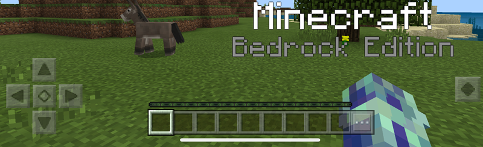
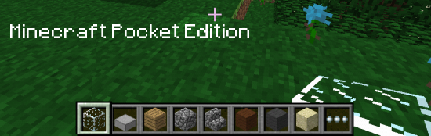

# Minecraft 中文文档 - 首页

## Minecraft 现代版

Minecraft 现代版(正式名称为`Minecraft: Java Edition`)是 Minecraft 的两个更新版本之一，下载、更新和游玩时需要一个付费帐户。大多数新开发项目的重点是从零开始创建全新的程序，与 Minecraft (如机器人或服务器)进行交互操作，或者对封装客户端或服务器并提供bug修复、新特性和现有功能增强的项目进行修改。

### 文档
目前正在努力保持逆向工程文档的更新，但这并不像听起来那么容易。协议通常在每个版本中都会略有变化，并且客户端类和服务器类在每个版本中都会重新排列。以下是当前文档部分的链接，这些部分可能是最新的，也可能不是完全最新的。

* [协议常见问题解答](Protocol_FAQ.md)
  * [客户端正常登录顺序](Protocol_FAQ.md#%E5%AE%A2%E6%88%B7%E7%AB%AF%E6%AD%A3%E5%B8%B8%E7%99%BB%E5%BD%95%E9%A1%BA%E5%BA%8F)
* [当前协议规范](Protocol.md)
  * [协议加密](Protocol_Encryption.md)
  * [服务器列表Ping](Server_List_Ping.md)
  * [协议版本号](Protocol_version_numbers.md)
  * [插件通道](Plugin_channels.md)
  * [协议历史](Protocol_History.md)
* Pre-release Protocol Specificaton
* Authentication Scheme
* [Mojang API](Mojang_API.md)
* Data Generators
* Location of Game Files
* Map Format (See also: mirror of the old NBT.txt)
* Snoop Mechanism
* Realms API
* Rcon and Query protocol specifications
* Debugging

### 工具 & Mods
* Clients - third-party Minecraft clients.
* Servers - third-party Minecraft servers.
* Libraries - libraries to interface with Minecraft data files or network protocols.
* Utilities - tools that interface with a client, server, or data files, such as proxies, bots, or inventory editors.
* Wrappers - mods that override features in the client or server
* Burger - a tool that generates information for arbitrary Minecraft versions
  * Pokechu22's fork that contains fixes for 1.13
  * Burger Vitrine - shows differences in data and protocol between arbitrary versions (prior to 1.7).
  * PAaaS - shows differences in protocol and sounds for newer versions (1.8 and above)
* Code Snippets

### 指导
* [如何编写客户端](How_to_Write_a_Client.md)
* [如何编写服务端](How_to_Write_a_Server.md)
* [Chat是如何工作的](Chat.md)

更多信息，请参见 [Minecraft Modern](https://wiki.vg/Category:Minecraft_Modern)

## Minecraft 基岩版

Minecraft基岩版(正式名称为`Minecraft: Bedrock Edition`)是多平台版本的Minecraft。它可用于手机、Xbox One、任天堂Switch和其他各种平台。

### 文档
* Current Protocol Specification - note that this is very WIP and many aspects may be incorrect. The Raknet Protocol is also not fully documented.
  * Bedrock version numbers

### 工具
有用的信息 & 链接

* [程序列表](https://wiki.vg/Bedrock_Edition_Program_List) - 第三方程序

更多信息，请参见 [Bedrock Minecraft](https://wiki.vg/Category:Bedrock_Minecraft) 。

## Minecraft 口袋版

Minecraft口袋版(正式名称为`Minecraft: Pocket Edition`，简称`MCPE`)，这是移动设备上基岩版的旧名称。

### 文档
The protocol and map format documentation for Minecraft: Pocket Edition.

* Old Protocol Specification (This protocol information is considered outdated, but still contains useful information)
* The current Protocol docs
* FAQ
* Login Procedure
* Pocket Realms
* Map Format

### 工具

有用的信息 & 链接

- [Program list](https://wiki.vg/Pocket_Edition_Program_List) - third-party PE programs

更多信息，请参见 [Pocket Minecraft](https://wiki.vg/Category:Pocket_Minecraft) 。

## Minecraft 经典版

Minecraft经典版(正式名称为`Minecraft Classic`)是Minecraft的原始版本，可免费向公众开放。它仍然有很多人在玩，有一个活跃的开发社区。它从2010年就开始了，而且因为它非常简单，所以有很多程序是为了经典版而制作的。

### 文档

由于本版本不再有任何工作要做，因此它的文档是稳定的。如果你创造了一些与之配合的东西，它可能永远都会支持。

* Protocol Specification
* Extension Protocol Specification
* Server Map Format (.dat)
* Saved Level Format (.mclevel)
* ClassicWorld Format (.cw)

### 源代码片段
源代码片段提供了对特定功能如何工作或如何实现的深入了解，并且它们本身通常可以在您自己的程序中免费使用。

* 反序列化 level.dat 格式文件 ([C#](https://gist.github.com/ddevault/324122945a569a513bae))

### 工具 & Mods
有用的信息 & 链接

* Clients - third-party Classic clients.
* Servers - third-party Classic servers.
* Libraries - libraries to interface with Minecraft data files or network protocols.
* Utilities - tools that interface with a client, server, or data files, such as proxies or bots.
* Wrappers - mods that override features in the client or server.

更多信息，请参见 [Minecraft Classic](https://wiki.vg/Category:Minecraft_Classic)

From https://wiki.vg/Main_Page